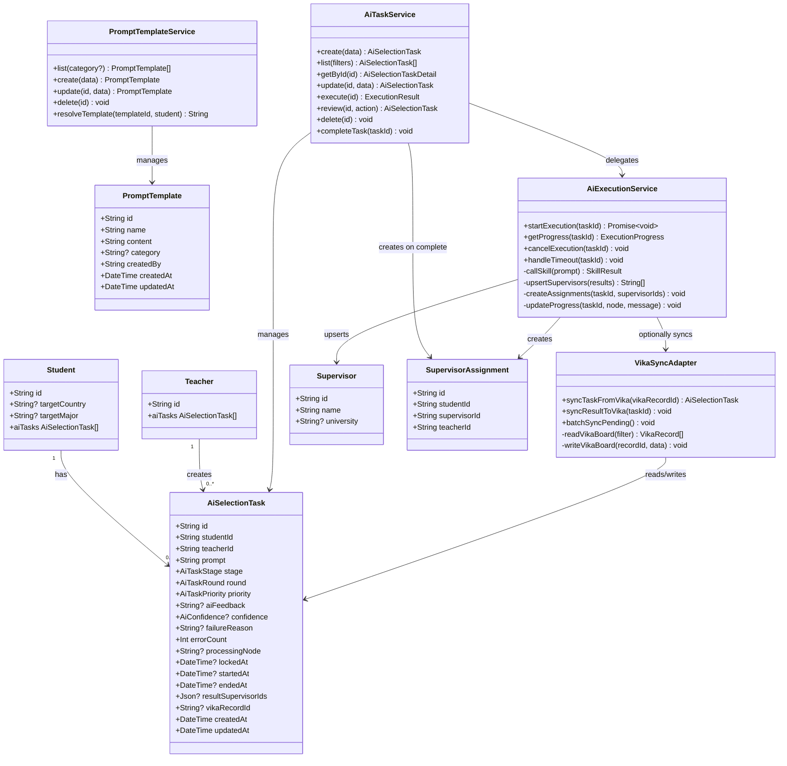
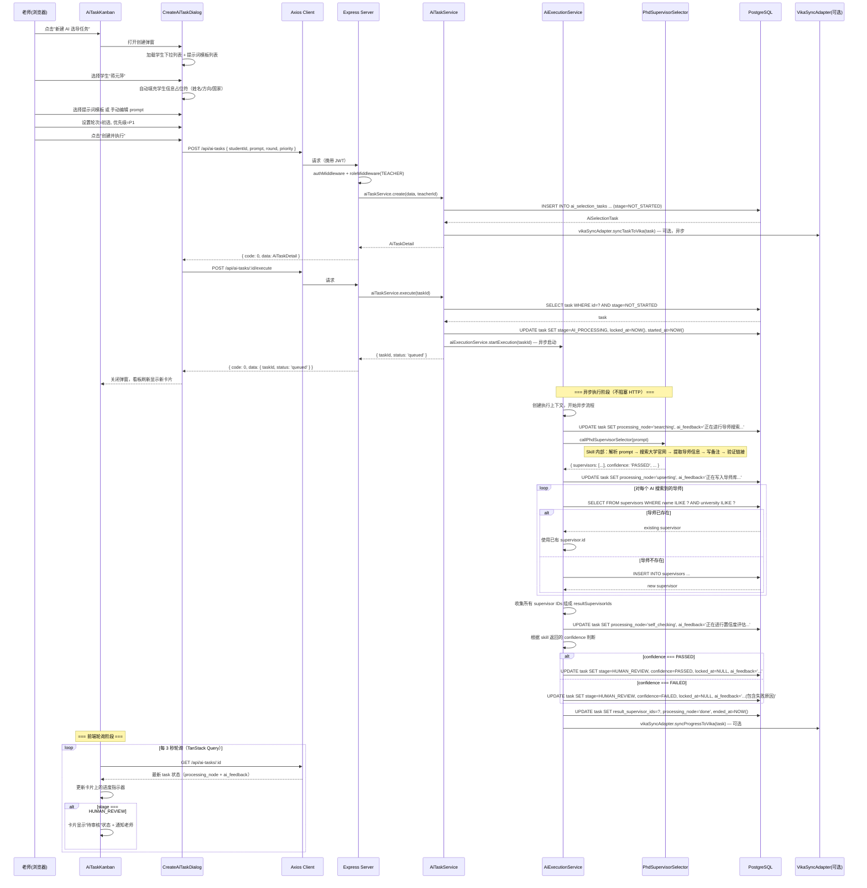
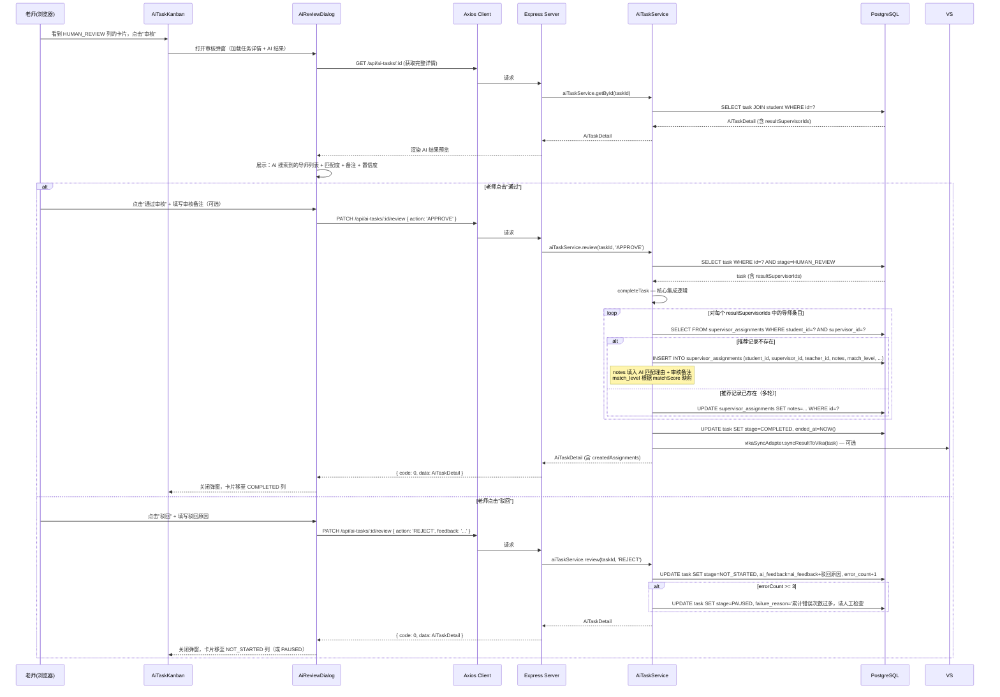
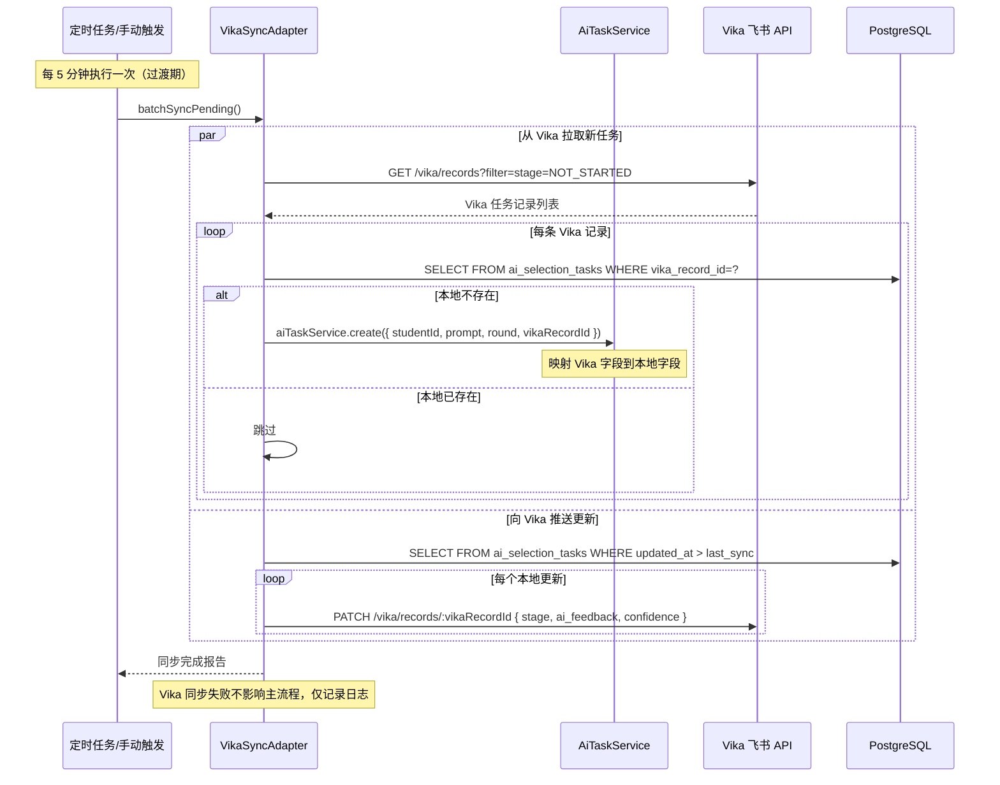
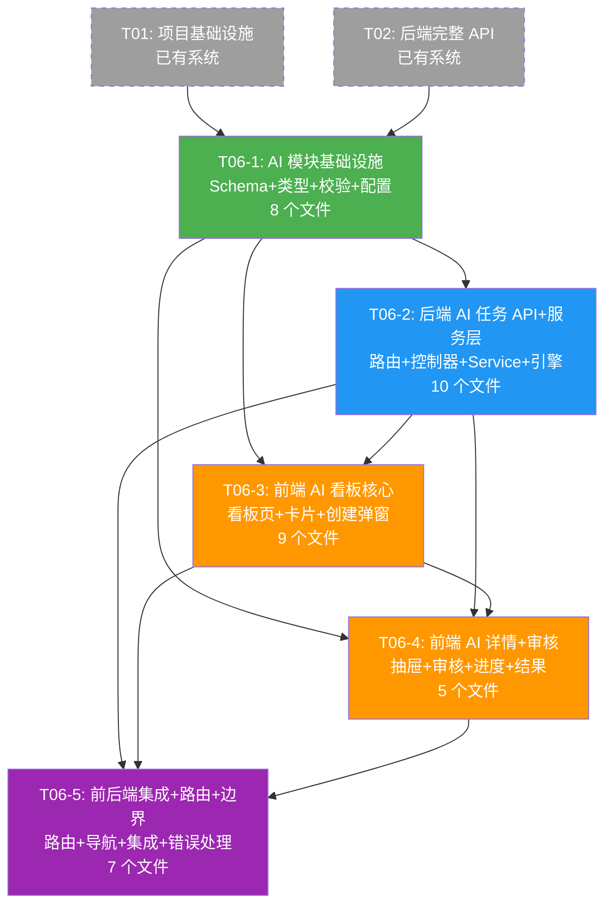

# AI 批量选导模块：架构补充设计文档

> **项目名称**：study_abroad_mgmt  
> **模块名称**：AI 批量选导（AI Batch Supervisor Selection）  
> **架构师**：Bob（高见远）  
> **版本**：v1.0  
> **日期**：2025-07-11  
> **基于**：architecture.md v1.0 + PRD v1.0 + 飞书看板分析

---

## 目录

- [Part A：系统设计](#part-a系统设计)
  - [1. 实现方案与框架选型](#1-实现方案与框架选型)
  - [2. 新增文件列表](#2-新增文件列表)
  - [3. 数据结构和接口](#3-数据结构和接口)
  - [4. 程序调用流程](#4-程序调用流程)
  - [5. AI 执行引擎设计](#5-ai-执行引擎设计)
  - [6. UI 设计说明](#6-ui-设计说明)
  - [7. 与已有系统的集成点](#7-与已有系统的集成点)
  - [8. 待明确事项](#8-待明确事项)
- [Part B：任务分解](#part-b任务分解)
  - [9. 依赖包列表](#9-依赖包列表)
  - [10. 任务列表](#10-任务列表有序含依赖关系)
  - [11. 共享知识](#11-共享知识跨文件约定)
  - [12. 任务依赖图](#12-任务依赖图)

---

## Part A：系统设计

### 1. 实现方案与框架选型

#### 1.1 核心技术挑战分析

| 挑战 | 说明 | 解决方案 |
|------|------|---------|
| **异步 AI 执行** | AI 搜索导师耗时较长（数分钟），不能阻塞 HTTP 请求 | 进程内异步执行 + 前端轮询状态（MVP），后续可升级为 Bull+Redis 任务队列 |
| **AI 结果与已有导师库关联** | AI 搜索到的导师需要去重并入已有 Supervisor 表 | 以 `name+university` 组合键做幂等匹配，已存在则复用，不存在则新建 |
| **多轮迭代支持** | 同一学生可多轮选导，每轮结果独立追踪 | `round` 枚举（FIRST/SECOND/THIRD）+ student_id 索引，每轮创建独立 AiSelectionTask |
| **Vika 并行过渡** | 新系统与 Vika 同时运行，数据双向同步 | VikaSyncAdapter 适配器模式，在任务生命周期关键节点同步 Vika，失败不影响主流程 |
| **AI 自检置信度** | AI 需要对搜索结果做质量评估 | 由 phd-supervisor-selector skill 返回置信度评分，后端存储并呈现 |
| **提示词模板复用** | 老师需要预定义模板快速填写 prompt | PromptTemplate 模型持久化存储，支持分类和按创建者筛选 |

#### 1.2 后端方案（沿用已有技术栈）

| 决策项 | 选择 | 理由 |
|--------|------|------|
| **异步执行** | 进程内 Promise + setTimeout | MVP 阶段无需额外中间件，减少运维复杂度。服务重启会丢失进行中任务（可接受，`AI_PROCESSING` 超时自动重置） |
| **Vika 适配器** | 独立 Service 类 | 适配器模式隔离 Vika API 细节，过渡期结束后可直接移除 |
| **外部 AI 调用** | `fetch`（Node.js 18+ 内置） | Node.js 20 原生支持，无需额外依赖 |
| **超时处理** | 30 分钟硬超时 | AI 搜索预期 5-15 分钟完成，30 分钟兜底。超时后 stage 回退为 NOT_STARTED，error_count++ |

#### 1.3 前端方案（沿用已有技术栈）

| 决策项 | 选择 | 理由 |
|--------|------|------|
| **看板布局** | CSS Grid + MUI Card | 按 stage 分 6 列的网格布局，卡片拖拽非 MVP 需求 |
| **轮询机制** | TanStack Query `refetchInterval` | 与老师工作台一致，AI 任务执行中 3s 轮询，空闲时 30s |
| **提示词模板** | MUI Autocomplete + Dialog | 弹出式模板选择器，支持搜索和分类过滤 |
| **审核界面** | MUI Dialog + 分步展示 | 宽对话框分左右栏：左栏 AI 结果预览，右栏操作面板 |

#### 1.4 数据流向总览

```
┌──────────┐   创建任务    ┌──────────────┐   异步执行   ┌─────────────────┐
│  Teacher  │──────────────▶│ AiSelection  │──────────────▶│ AI Execution    │
│  (老师)   │               │ Task         │               │ Engine          │
└──────────┘               │ (ai_sel_tasks)│               │ (ai-execution   │
                           └──────┬───────┘               │  .service.ts)   │
                                  │                        └────────┬────────┘
                    ┌─────────────┼─────────────┐                   │
                    │             │             │          调用 phd-supervisor-
                    ▼             ▼             ▼          selector skill
              ┌──────────┐ ┌──────────┐ ┌──────────┐           │
              │ NOT_     │ │ AI_      │ │ AI_SELF  │           │
              │ STARTED  │ │PROCESSING│ │ _CHECK   │◀──────────┘
              └──────────┘ └──────────┘ └────┬─────┘
                                             │
                    ┌────────────────────────┼──────────────┐
                    │                        │              │
                    ▼                        ▼              ▼
              ┌──────────┐           ┌──────────┐   ┌──────────┐
              │ HUMAN_   │──通过──▶  │COMPLETED │   │  PAUSED  │
              │ REVIEW   │           │→创建      │   │  (暂停)  │
              └────┬─────┘           │Assignment │   └──────────┘
                   │驳回              └──────────┘
                   ▼
             (回到 AI_PROCESSING
              或 NOT_STARTED)
```

---

### 2. 新增文件列表

#### 2.1 后端新增/修改文件

| 文件路径 | 操作 | 职责 |
|---------|------|------|
| `backend/prisma/schema.prisma` | **修改** | 新增 4 个枚举 + 2 个模型 + 已有模型关联字段 |
| `backend/prisma/seed.ts` | **修改** | 新增提示词模板种子数据（5-8 条预置模板） |
| `backend/src/config/index.ts` | **修改** | 新增 AI 配置项（超时时间、并发限制、Vika API 密钥） |
| `backend/src/types/index.ts` | **修改** | 新增 AiSelectionTask、PromptTemplate 类型定义 |
| `backend/src/utils/validation.ts` | **修改** | 新增 AI 任务和模板的 Zod schema |
| `backend/src/middleware/role.ts` | **修改** | AI 任务路由权限：TEACHER + ADMIN |
| `backend/src/routes/ai-task.routes.ts` | **新增** | AI 选导任务路由（7 个端点） |
| `backend/src/routes/prompt-template.routes.ts` | **新增** | 提示词模板路由（4 个端点） |
| `backend/src/controllers/ai-task.controller.ts` | **新增** | AI 任务控制器（参数校验 + 调用 service） |
| `backend/src/controllers/prompt-template.controller.ts` | **新增** | 提示词模板控制器 |
| `backend/src/services/ai-task.service.ts` | **新增** | AI 任务核心业务逻辑（CRUD + 状态机 + 完成→Assignment 创建） |
| `backend/src/services/ai-execution.service.ts` | **新增** | AI 异步执行引擎（调用 skill + 进度更新 + 超时处理） |
| `backend/src/services/vika-sync.service.ts` | **新增** | Vika 并行同步适配器（读 Vika 任务 / 写 Vika 结果） |
| `backend/src/services/prompt-template.service.ts` | **新增** | 提示词模板 CRUD |
| `backend/src/app.ts` | **修改** | 挂载 `/api/ai-tasks` 和 `/api/prompt-templates` 路由 |

#### 2.2 前端新增/修改文件

| 文件路径 | 操作 | 职责 |
|---------|------|------|
| `frontend/src/types/index.ts` | **修改** | 新增 AI 任务和模板前端类型 |
| `frontend/src/utils/constants.ts` | **修改** | 新增 stage/round/confidence/priority 的显示映射 |
| `frontend/src/api/ai-tasks.ts` | **新增** | AI 任务 API 请求层（7 个端点） |
| `frontend/src/api/prompt-templates.ts` | **新增** | 提示词模板 API 请求层 |
| `frontend/src/hooks/useAiTasks.ts` | **新增** | AI 任务 TanStack Query hooks（列表/详情/创建/更新/执行/审核） |
| `frontend/src/hooks/usePromptTemplates.ts` | **新增** | 提示词模板 hooks |
| `frontend/src/pages/teacher/AiTaskKanban.tsx` | **新增** | AI 任务看板页面（看板 + 工具栏） |
| `frontend/src/components/teacher/AiTaskBoard.tsx` | **新增** | 看板主组件（6 列 CSS Grid 布局） |
| `frontend/src/components/teacher/AiTaskColumn.tsx` | **新增** | 看板单列（stage 标题 + 卡片列表） |
| `frontend/src/components/teacher/AiTaskCard.tsx` | **新增** | 任务卡片（学生名+轮次+优先级+进度+置信度） |
| `frontend/src/components/teacher/CreateAiTaskDialog.tsx` | **新增** | 创建任务弹窗（学生选择 + prompt 编辑 + 模板选择 + 轮次/优先级设置） |
| `frontend/src/components/teacher/AiTaskDetailDrawer.tsx` | **新增** | 任务详情抽屉（全字段展示 + AI 反馈日志 + 结果导师列表） |
| `frontend/src/components/teacher/AiReviewDialog.tsx` | **新增** | 人工审核弹窗（AI 结果预览 + 通过/驳回操作 + 反馈备注） |
| `frontend/src/components/teacher/PromptTemplateSelector.tsx` | **新增** | 提示词模板选择器（搜索 + 分类过滤 + 预览） |
| `frontend/src/components/teacher/AiProgressIndicator.tsx` | **新增** | AI 执行进度指示器（阶段指示条 + 处理节点展示） |
| `frontend/src/components/teacher/AiResultSupervisorList.tsx` | **新增** | AI 结果导师列表（卡片视图，展示匹配的导师信息） |
| `frontend/src/components/common/Layout.tsx` | **修改** | 老师导航栏新增"AI 选导"入口 |
| `frontend/src/router/index.tsx` | **修改** | 新增 `/teacher/ai-tasks` 路由 |

---

### 3. 数据结构和接口

#### 3.1 数据库 Schema 变更（Prisma）

```prisma
// ==================== 新增枚举 ====================

enum AiTaskStage {
  NOT_STARTED     // 未开始
  AI_PROCESSING   // AI 执行中
  AI_SELF_CHECK   // AI 自检中（置信度评估）
  HUMAN_REVIEW    // 人工待审批
  COMPLETED       // 已完成
  PAUSED          // 已暂停
}

enum AiTaskRound {
  FIRST           // 初选
  SECOND          // 第二轮
  THIRD           // 第三轮
}

enum AiConfidence {
  PASSED          // AI 自检通过
  FAILED          // AI 自检未通过
}

enum AiTaskPriority {
  P0              // 最高优先级
  P1              // 普通优先级
  P2              // 低优先级
}

// ==================== 新增模型 ====================

model AiSelectionTask {
  id                  String         @id @default(uuid())
  studentId           String         @map("student_id")
  student             Student        @relation(fields: [studentId], references: [id], onDelete: Cascade)
  teacherId           String         @map("teacher_id")
  teacher             Teacher        @relation(fields: [teacherId], references: [id])
  prompt              String         @db.Text                                   // AI 搜索提示词（含学生背景+方向+目标+Vika链接+指令）
  stage               AiTaskStage    @default(NOT_STARTED)                     // 当前阶段
  round               AiTaskRound    @default(FIRST)                           // 第几轮选导
  priority            AiTaskPriority @default(P1)                              // 优先级
  aiFeedback          String?        @map("ai_feedback")     @db.Text          // AI 执行反馈（渐进更新）
  confidence          AiConfidence?                                             // AI 自检置信度
  failureReason       String?        @map("failure_reason")  @db.Text          // 失败原因
  errorCount          Int            @default(0)            @map("error_count")// 累计错误次数
  processingNode      String?        @map("processing_node")                   // 当前处理节点（如"searching"→"filling"→"verifying"）
  lockedAt            DateTime?      @map("locked_at")                         // 锁定时间（防止并发执行）
  startedAt           DateTime?      @map("started_at")                        // 开始执行时间
  endedAt             DateTime?      @map("ended_at")                          // 结束时间
  resultSupervisorIds Json?          @map("result_supervisor_ids")             // AI 搜索到的导师 ID 列表（JSON 数组）
  vikaRecordId        String?        @map("vika_record_id")                    // Vika 飞书看板记录 ID（过渡期同步用）
  createdAt           DateTime       @default(now())        @map("created_at")
  updatedAt           DateTime       @updatedAt             @map("updated_at")

  @@index([studentId])
  @@index([teacherId])
  @@index([stage])
  @@index([round])
  @@index([studentId, round])    // 复合索引：查询某学生某轮任务
  @@map("ai_selection_tasks")
}

model PromptTemplate {
  id        String   @id @default(uuid())
  name      String                                                             // 模板名称
  content   String   @db.Text                                                  // 模板内容（支持 {student_name} {target_country} {target_major} 占位符）
  category  String?                                                            // 分类（如"通用"/"理工科"/"人文社科"/"商科"）
  createdBy String   @map("created_by")                                        // 创建者 userId
  createdAt DateTime @default(now())        @map("created_at")
  updatedAt DateTime @updatedAt             @map("updated_at")

  @@index([category])
  @@index([createdBy])
  @@map("prompt_templates")
}

// ==================== 已有模型新增关联 ====================

// Student 模型新增：
//   aiTasks  AiSelectionTask[]

// Teacher 模型新增：
//   aiTasks  AiSelectionTask[]
```

#### 3.2 新增类关系图



#### 3.3 完整 API 接口设计

##### 统一响应格式（沿用已有）

```typescript
// 成功
{ "code": 0, "data": T, "message": "success" }
// 错误
{ "code": 4xxx, "data": null, "message": "错误描述" }
```

##### 3.3.1 AI 选导任务接口

| Method | Path | 角色 | 请求体/Query | 响应 data | 说明 |
|--------|------|------|-------------|----------|------|
| POST | `/api/ai-tasks` | Teacher, Admin | `CreateAiTaskInput` | `AiTaskDetail` | 创建 AI 选导任务 |
| GET | `/api/ai-tasks` | Teacher, Admin | Query: `stage?, round?, priority?, teacherId?, studentId?, page?, pageSize?` | `{ items: AiTaskSummary[], total: number }` | 任务列表（支持多维度筛选） |
| GET | `/api/ai-tasks/:id` | Teacher(self), Admin | — | `AiTaskDetail` | 任务详情（含 AI 反馈日志 + 结果导师列表） |
| PATCH | `/api/ai-tasks/:id` | Teacher(self), Admin | `UpdateAiTaskInput` | `AiTaskDetail` | 更新任务字段（prompt/priority/stage 等） |
| POST | `/api/ai-tasks/:id/execute` | Teacher(self), Admin | `{ forceRerun?: boolean }` | `{ taskId: string, status: 'queued' }` | 触发 AI 异步执行 |
| PATCH | `/api/ai-tasks/:id/review` | Teacher(self), Admin | `ReviewInput` | `AiTaskDetail` | 老师审核（通过→发布；驳回→回退） |
| DELETE | `/api/ai-tasks/:id` | Teacher(self), Admin | — | `{ success: true }` | 删除任务（仅 NOT_STARTED/COMPLETED/PAUSED） |

```typescript
// ===== 请求类型 =====

interface CreateAiTaskInput {
  studentId: string;                                    // 必填：关联学生
  prompt: string;                                       // 必填：AI 搜索提示词
  round?: 'FIRST' | 'SECOND' | 'THIRD';                // 默认 FIRST
  priority?: 'P0' | 'P1' | 'P2';                       // 默认 P1
  vikaRecordId?: string;                                // 可选：关联 Vika 记录
}

interface UpdateAiTaskInput {
  prompt?: string;
  priority?: 'P0' | 'P1' | 'P2';
  round?: 'FIRST' | 'SECOND' | 'THIRD';
  stage?: 'NOT_STARTED' | 'PAUSED';                    // 仅允许手动设为这两个状态
  failureReason?: string;
}

interface ReviewInput {
  action: 'APPROVE' | 'REJECT';                        // 通过或驳回
  feedback?: string;                                     // 审核备注
}

// ===== 响应类型 =====

interface AiTaskSummary {
  id: string;
  studentId: string;
  studentName: string;
  teacherId: string;
  teacherName: string;
  prompt: string;                                       // 截断至前 100 字符
  stage: AiTaskStage;
  round: AiTaskRound;
  priority: AiTaskPriority;
  confidence: AiConfidence | null;
  errorCount: number;
  processingNode: string | null;
  lockedAt: string | null;
  startedAt: string | null;
  endedAt: string | null;
  createdAt: string;
  updatedAt: string;
}

interface AiTaskDetail extends AiTaskSummary {
  prompt: string;                                       // 完整 prompt
  aiFeedback: string | null;                            // 完整 AI 反馈
  failureReason: string | null;
  resultSupervisorIds: ResultSupervisorEntry[] | null;  // AI 搜索到的导师
  vikaRecordId: string | null;
  // 关联的学生信息
  student: {
    id: string;
    name: string;
    grade: string | null;
    targetCountry: string | null;
    targetMajor: string | null;
  };
  // 关联的已有 assignments（AI 完成后生成）
  createdAssignments?: {
    id: string;
    supervisorId: string;
    supervisorName: string;
  }[];
}

interface ResultSupervisorEntry {
  supervisorId: string;
  supervisorName: string;
  university: string | null;
  matchScore: number;                                   // 0-1 匹配度评分
  matchNotes: string;                                    // AI 匹配理由
}
```

##### 3.3.2 提示词模板接口

| Method | Path | 角色 | 请求体 | 响应 data | 说明 |
|--------|------|------|--------|----------|------|
| GET | `/api/prompt-templates` | Teacher, Admin | Query: `category?, search?` | `PromptTemplate[]` | 模板列表 |
| POST | `/api/prompt-templates` | Teacher, Admin | `{ name, content, category? }` | `PromptTemplate` | 创建模板 |
| PUT | `/api/prompt-templates/:id` | Teacher(self), Admin | `{ name?, content?, category? }` | `PromptTemplate` | 更新模板 |
| DELETE | `/api/prompt-templates/:id` | Teacher(self), Admin | — | `{ success: true }` | 删除模板 |

```typescript
interface PromptTemplate {
  id: string;
  name: string;
  content: string;          // 支持占位符: {student_name} {target_country} {target_major}
  category: string | null;  // "通用" | "理工科" | "人文社科" | "商科"
  createdBy: string;
  createdAt: string;
  updatedAt: string;
}
```

##### 3.3.3 新增错误码

| 错误码 | 含义 | HTTP Status |
|--------|------|-------------|
| 4010 | AI 任务不存在 | 404 |
| 4011 | AI 任务正在执行中，不可重复触发 | 409 |
| 4012 | AI 任务不在可审核状态 | 409 |
| 4013 | AI 任务已锁定（并发保护） | 409 |
| 4014 | AI 执行超时 | 408 |
| 4015 | AI 执行失败（已达最大重试次数） | 500 |
| 4016 | 提示词模板不存在 | 404 |

---

### 4. 程序调用流程

#### 4.1 创建任务 + AI 执行完整流程



#### 4.2 老师审核 + 结果发布流程



#### 4.3 Vika 同步流程（过渡期）



---

### 5. AI 执行引擎设计

#### 5.1 架构概览

```
┌──────────────────────────────────────────────────────┐
│                  AiExecutionService                   │
│                                                      │
│  ┌──────────────┐   ┌──────────────┐   ┌──────────┐ │
│  │ Task Runner   │   │ Progress     │   │ Timeout  │ │
│  │ (async exec)  │   │ Reporter     │   │ Watchdog │ │
│  └──────┬───────┘   └──────┬───────┘   └────┬─────┘ │
│         │                  │                 │       │
│         ▼                  ▼                 ▼       │
│  ┌──────────────┐   ┌──────────────┐   ┌──────────┐ │
│  │ Skill Caller  │   │ DB Updater   │   │ Error    │ │
│  │ (phd-supervisor│  │ (task stage/ │   │ Handler  │ │
│  │  -selector)   │   │  feedback)   │   │ (retry)  │ │
│  └──────────────┘   └──────────────┘   └──────────┘ │
└──────────────────────────────────────────────────────┘
```

#### 5.2 执行流程状态机

```
                    ┌─────────────┐
                    │ NOT_STARTED │────── PAUSE ──────┐
                    └──────┬──────┘                    │
                           │ execute()                 │
                           ▼                           │
                    ┌──────────────┐                   │
                    │ AI_PROCESSING│                   │
                    └──────┬───────┘                   │
                           │                           │
                    ┌──────┼──────┐                    │
                    │      │      │                    │
                    ▼      ▼      ▼                    │
              [timeout] [error] [skill返回]             │
                    │      │      │                    │
                    ▼      ▼      ▼                    │
              NOT_STARTED  errorCount≥3?               │
              (可重试)     ┌───┴───┐                   │
                          │YES    │NO                 │
                          ▼       ▼                    │
                      PAUSED  NOT_STARTED              │
                          │       │                    │
                          └───┬───┘                    │
                              │ (非超时/非致命错误)      │
                              ▼                        │
                    ┌──────────────┐                   │
                    │ AI_SELF_CHECK│                   │
                    └──────┬───────┘                   │
                           │                           │
                    ┌──────┼──────┐                    │
                    │             │                    │
                    ▼             ▼                    │
              confidence      confidence               │
              =PASSED         =FAILED                  │
                    │             │                    │
                    └──────┬──────┘                    │
                           ▼                           │
                    ┌──────────────┐                   │
                    │ HUMAN_REVIEW │◀──────────────────┘
                    └──────┬───────┘       (PAUSED→手动恢复→HUMAN_REVIEW)
                           │
                    ┌──────┼──────┐
                    │             │
                    ▼             ▼
              APPROVE         REJECT
                    │             │
                    ▼             ▼
              ┌──────────┐  NOT_STARTED
              │ COMPLETED│  (或 errorCount≥3→PAUSED)
              └──────────┘
```

#### 5.3 异步执行模型

```typescript
// ai-execution.service.ts 核心结构

class AiExecutionService {
  private activeExecutions: Map<string, AbortController> = new Map();
  private readonly MAX_CONCURRENT = 3;         // 最大并发执行数
  private readonly TIMEOUT_MS = 30 * 60 * 1000; // 30 分钟超时
  private readonly MAX_RETRIES = 3;             // 最大重试次数（每次创建任务计）

  /**
   * 启动异步 AI 执行。不阻塞调用者。
   * 通过定期更新 ai_selection_tasks 表的 stage/processing_node/ai_feedback 来报告进度。
   * 前端通过轮询 GET /api/ai-tasks/:id 获取进度。
   */
  async startExecution(taskId: string): Promise<void> {
    // 1. 并发控制：检查 activeExecutions.size < MAX_CONCURRENT
    // 2. 创建 AbortController 用于取消
    // 3. 在后台启动异步流程（不 await）
    // 4. 使用 Promise 链处理完成/失败
    this.runAsync(taskId).catch(err => this.handleError(taskId, err));
  }

  private async runAsync(taskId: string): Promise<void> {
    // Step 1: 设置超时定时器
    const timeout = setTimeout(() => this.handleTimeout(taskId), this.TIMEOUT_MS);

    try {
      // Step 2: 加载任务和关联学生信息
      const task = await this.loadTask(taskId);
      const student = await this.loadStudent(task.studentId);

      // Step 3: 解析 prompt，替换占位符
      const resolvedPrompt = this.resolvePrompt(task.prompt, student);

      // Step 4: 上报进度 → searching_supervisors
      await this.updateProgress(taskId, 'searching_supervisors', '正在进行导师搜索...');

      // Step 5: 调用 phd-supervisor-selector skill
      const result = await this.callPhdSupervisorSelector(resolvedPrompt);

      // Step 6: 上报进度 → filling_supervisor_info
      await this.updateProgress(taskId, 'filling_supervisor_info', '正在整理导师信息...');

      // Step 7: 人库匹配（去重 + 新建）
      const supervisorIds = await this.upsertSupervisors(taskId, result.supervisors);

      // Step 8: 存储结果
      await this.saveResultSupervisors(taskId, supervisorIds);

      // Step 9: 上报进度 → self_checking
      await this.updateProgress(taskId, 'self_checking', '正在进行置信度评估...');

      // Step 10: 置信度评估
      const confidence = this.evaluateConfidence(result);

      // Step 11: 更新任务为 HUMAN_REVIEW
      await this.completeExecution(taskId, confidence, result.summary);

    } finally {
      clearTimeout(timeout);
      this.activeExecutions.delete(taskId);
    }
  }

  /**
   * 调用 phd-supervisor-selector Skill
   *
   * 集成方式（MVP）：
   * - 通过 HTTP 调用 skill 暴露的 API 端点
   * - 请求体包含完整的 prompt（学生背景 + 方向 + 目标地区 + 操作指令）
   * - 响应包含 supervisor 列表 + confidence + 执行摘要
   *
   * 后续可升级为直接调用 WorkBuddy Skill API
   */
  private async callPhdSupervisorSelector(prompt: string): Promise<SkillResult> {
    // MVP: 使用 fetch 调用 skill 的 HTTP API
    // 实际端点和认证方式根据 phd-supervisor-selector skill 的部署配置决定
  }

  /**
   * 导师去重入库
   * 匹配策略：name + university 近似匹配
   * 已存在 → 复用已有 supervisor.id
   * 不存在 → 新建 Supervisor 记录
   */
  private async upsertSupervisors(taskId: string, supervisors: SkillSupervisor[]): Promise<ResultSupervisorEntry[]> {
    // ...
  }
}
```

#### 5.4 处理节点（processingNode）枚举

| 节点值 | 含义 | 预计耗时 |
|--------|------|---------|
| `searching_supervisors` | 正在搜索匹配导师 | 2-8 分钟 |
| `filling_supervisor_info` | 正在整理导师详细信息 | 1-3 分钟 |
| `verifying_links` | 正在验证导师主页/邮箱链接 | 1-2 分钟 |
| `self_checking` | AI 正在进行置信度自检 | 0.5-1 分钟 |
| `done` | 执行完成（等待审核） | — |

#### 5.5 Vika 同步适配器

```typescript
// vika-sync.service.ts 核心结构

class VikaSyncAdapter {
  private enabled: boolean;     // 可通过环境变量 VIKA_SYNC_ENABLED 控制
  private vikaApiBase: string;
  private vikaApiToken: string;

  /**
   * 将本地任务同步到 Vika（新建时）
   */
  async syncTaskToVika(task: AiSelectionTask): Promise<void> {
    if (!this.enabled || task.vikaRecordId) return; // 已有 Vika 记录则跳过
    // POST Vika API → 创建看板行 → 回写 vika_record_id
  }

  /**
   * 将本地进度同步到 Vika（执行中）
   */
  async syncProgressToVika(task: AiSelectionTask): Promise<void> {
    if (!this.enabled || !task.vikaRecordId) return;
    // PATCH Vika API → 更新看板行的 stage/ai_feedback/processing_node
  }

  /**
   * 将最终结果同步到 Vika（完成后）
   */
  async syncResultToVika(task: AiSelectionTask): Promise<void> {
    if (!this.enabled || !task.vikaRecordId) return;
    // PATCH Vika API → 更新看板行的 stage=COMPLETED + result 信息
  }

  /**
   * 从 Vika 拉取新任务（批量同步）
   */
  async syncTaskFromVika(vikaRecordId: string): Promise<Partial<AiSelectionTask>> {
    // GET Vika API → 解析看板行 → 映射到 AiSelectionTask 字段
  }

  /**
   * 批量双向同步（定时任务触发）
   */
  async batchSyncPending(): Promise<SyncReport> {
    // 1. 拉取 Vika 中新增的任务 → 创建本地 AiSelectionTask
    // 2. 推送本地有变更的任务 → 更新 Vika 看板
    // 3. 返回同步报告
  }
}
```

---

### 6. UI 设计说明

#### 6.1 AI 任务看板页（/teacher/ai-tasks）

```
┌──────────────────────────────────────────────────────────────────────────────┐
│  AI 批量选导                                        [+ 新建任务] [模板管理]   │
│                                                                              │
│  筛选栏：[全部阶段 ▼] [全部轮次 ▼] [优先级 ▼] [学生搜索...]  [我的任务 ☑]    │
├──────────────────────────────────────────────────────────────────────────────┤
│                                                                              │
│  NOT_STARTED    AI_PROCESSING    AI_SELF_CHECK   HUMAN_REVIEW   COMPLETED    │
│  ┌─────────┐   ┌──────────┐    ┌──────────┐    ┌──────────┐   ┌─────────┐  │
│  │蒋元萍    │   │ 王明      │    │ 李华      │    │ 张伟      │   │ 赵六    │  │
│  │初选 P1   │   │ 初选 P1   │    │ 初选 P1   │    │ 二轮 P0   │   │ 初选 P1 │  │
│  │---       │   │🔄searching│    │🟡自检中.. │    │🟢PASSED  │   │✅ 已完成 │  │
│  │创建:2h前 │   │进度:45%   │    │---        │    │3位导师    │   │5位导师  │  │
│  │[▶ 执行]  │   │[查看详情] │    │[查看详情]  │    │[审核 ✋]  │   │[查看详情]│  │
│  └─────────┘   └──────────┘    └──────────┘    └──────────┘   └─────────┘  │
│  ┌─────────┐                                                                 │
│  │ 刘洋    │                                                                 │
│  │ 二轮 P2 │                                                                 │
│  │失败:1次  │                                                                 │
│  │[▶ 重试]  │                                                                 │
│  └─────────┘                                                                 │
│                                                                              │
└──────────────────────────────────────────────────────────────────────────────┘
```

**布局说明：**
- **顶部工具栏**：新建任务按钮 + 模板管理入口 + 筛选条件（阶段/轮次/优先级/学生搜索/只看我的任务）
- **看板主体**：CSS Grid 6 列布局，每列对应一个 stage
  - 列标题显示 stage 中文名 + 任务计数
  - 卡片在列内纵向排列，超出可滚动
  - 卡片颜色：P0=红色边框、P1=默认、P2=灰色
- **卡片内容**：
  - 学生姓名 + 轮次标签 + 优先级徽章
  - 当前处理节点/进度（AI_PROCESSING 时显示进度条）
  - 置信度结果（AI_SELF_CHECK/HUMAN_REVIEW 时显示 PASSED/FAILED 标签）
  - 结果导师数量（COMPLETED/HUMAN_REVIEW 时显示）
  - 操作按钮：执行/重试/查看详情/审核

#### 6.2 创建任务弹窗

```
┌───────────────────────────────────────────────────────────┐
│  新建 AI 选导任务                                    [✕]  │
│                                                           │
│  ┌─────────────────────────────────────────────────────┐  │
│  │ 学生 *                                               │  │
│  │ [选择学生 ▼]                                         │  │
│  │ 选中后显示：蒋元萍 | 目标：美国 | 方向：计算机科学     │  │
│  └─────────────────────────────────────────────────────┘  │
│                                                           │
│  ┌─────────────────────────────────────────────────────┐  │
│  │ 提示词模板              [📋 从模板库选择]              │  │
│  │ ┌─────────────────────────────────────────────────┐ │  │
│  │ │ 请为 {student_name} 搜索导师。                   │ │  │
│  │ │ 学生背景：计算机科学本科，GPA 3.8                │ │  │
│  │ │ 目标地区：美国                                   │ │  │
│  │ │ 目标专业：NLP/ML 方向 PhD                        │ │  │
│  │ │ 所在 Vika 表链接：{vika_link}                   │ │  │
│  │ │ 操作指令：                                       │ │  │
│  │ │ 1. 搜索匹配导师并填入信息                        │ │  │
│  │ │ 2. 填写匹配度备注                                │ │  │
│  │ │ 3. 验证导师主页链接                              │ │  │
│  │ └─────────────────────────────────────────────────┘ │  │
│  └─────────────────────────────────────────────────────┘  │
│                                                           │
│  ┌────────────────┐  ┌────────────────┐                   │
│  │ 轮次：[初选 ▼]  │  │ 优先级：[P1 ▼]  │                   │
│  └────────────────┘  └────────────────┘                   │
│                                                           │
│                              [保存草稿]  [创建并执行 ▶]    │
└───────────────────────────────────────────────────────────┘
```

**交互说明：**
- 选择学生后自动在 prompt 编辑器中替换 `{student_name}`、`{target_country}`、`{target_major}` 等占位符
- "从模板库选择"弹出 PromptTemplateSelector 组件
- 点击"创建并执行"：先 POST 创建任务 → 收到响应后自动 POST /execute
- 点击"保存草稿"：仅 POST 创建任务，不执行

#### 6.3 任务详情抽屉（右侧滑出）

```
┌───────────────────────────────────────────────────────────┐
│  任务详情：蒋元萍 - 初选                              [✕]  │
│                                                           │
│  ┌─ 基本信息 ──────────────────────────────────────────┐  │
│  │ 学生：蒋元萍 | 年级：大四 | 目标：美国/CS           │  │
│  │ 负责老师：张老师                                     │  │
│  │ 轮次：初选 | 优先级：P1 | 状态：AI_PROCESSING        │  │
│  │ 创建时间：2025-07-11 14:30                          │  │
│  └─────────────────────────────────────────────────────┘  │
│                                                           │
│  ┌─ AI 执行进度 ───────────────────────────────────────┐  │
│  │  [searching] → [filling] → [verifying] → [checking] │  │
│  │   ████████████░░░░░░░░░░░░  45%                     │  │
│  │  当前：正在搜索匹配导师...                            │  │
│  │  ┌─────────────────────────────────────────────────┐ │  │
│  │  │ [时间戳] 正在进行导师搜索...                     │ │  │
│  │  │ [时间戳] 已匹配 5 位潜在导师...                  │ │  │
│  │  │ [时间戳] 正在获取详细信息...                     │ │  │
│  │  └─────────────────────────────────────────────────┘ │  │
│  └─────────────────────────────────────────────────────┘  │
│                                                           │
│  ┌─ 执行历史 ──────────────────────────────────────────┐  │
│  │ 第 1 次执行：2025-07-11 14:31 — 超时（30分钟）      │  │
│  │ 第 2 次执行：2025-07-11 15:05 — 进行中...           │  │
│  └─────────────────────────────────────────────────────┘  │
│                                                           │
│                              [暂停任务]  [取消并重试]      │
└───────────────────────────────────────────────────────────┘
```

#### 6.4 人工审核弹窗

```
┌─────────────────────────────────────────────────────────────┐
│  审核 AI 选导结果：蒋元萍 — 初选                         [✕] │
│                                                             │
│  ┌─ 左侧：AI 搜索到的导师 ─┐ ┌─ 右侧：审核操作 ──────────┐  │
│  │                         │ │                            │  │
│  │ ┌─────────────────────┐ │ │ AI 自检结果：              │  │
│  │ │ Prof. Smith         │ │ │ 🟢 置信度：PASSED          │  │
│  │ │ MIT · QS#1 · 美国   │ │ │                            │  │
│  │ │ 匹配度：95%          │ │ │ 执行摘要：                 │  │
│  │ │ 理由：研究方向高度匹配│ │ │ 搜索到 8 位导师，         │  │
│  │ │ NLP，论文引用量高    │ │ │ 其中 5 位通过链接验证，   │  │
│  │ │ 🔗主页 ✅验证        │ │ │ 3 位链接无法访问已标记    │  │
│  │ │ 📧邮箱 ✅验证        │ │ │                            │  │
│  │ └─────────────────────┘ │ │ 审核备注：                 │  │
│  │ ┌─────────────────────┐ │ │ ┌────────────────────────┐ │  │
│  │ │ Dr. Johnson         │ │ │ │                        │ │  │
│  │ │ Stanford · QS#3     │ │ │ │                        │ │  │
│  │ │ 匹配度：88%          │ │ │ │                        │ │  │
│  │ │ 理由：ML方向匹配...  │ │ │ └────────────────────────┘ │  │
│  │ └─────────────────────┘ │ │                            │  │
│  │ ┌─────────────────────┐ │ │                            │  │
│  │ │ ...                 │ │ │ [✕ 驳回]  [✓ 通过审核]    │  │
│  │ └─────────────────────┘ │ │                            │  │
│  └─────────────────────────┘ └────────────────────────────┘  │
└─────────────────────────────────────────────────────────────┘
```

**交互说明：**
- 左右分栏布局：左栏可滚动浏览 AI 搜索到的导师（含匹配度和链接验证状态），右栏显示操作面板
- 通过：stage → COMPLETED，自动创建 SupervisorAssignment 记录，结果发布到学生端
- 驳回：stage → NOT_STARTED（或 errorCount≥3 → PAUSED），老师可填写驳回原因指导下次搜索
- 支持逐条勾选导师（默认全选），只将通过勾选的导师发布给学生

---

### 7. 与已有系统的集成点

#### 7.1 AI 任务完成 → 自动创建 SupervisorAssignment

这是最关键的集成点。当老师在审核中点击"通过"时：

```
AiTaskService.review(taskId, 'APPROVE')
  └── completeTask(taskId)
        │
        ├── 1. 读取 ai_selection_tasks.result_supervisor_ids
        │      (JSON 数组：[{supervisorId, supervisorName, matchScore, matchNotes}, ...])
        │
        ├── 2. 匹配度映射
        │      matchScore >= 0.7  → matchLevel = HIGH ("建议多看看")
        │      matchScore < 0.7   → matchLevel = MEDIUM ("可以备选")
        │
        ├── 3. 对每个 resultSupervisorIds 条目：
        │      │
        │      ├── 检查 SupervisorAssignment 是否存在 (@@unique([studentId, supervisorId]))
        │      │   ├── 不存在 → INSERT supervisor_assignments
        │      │   │              (student_id, supervisor_id, teacher_id,
        │      │   │               notes = matchNotes + 审核备注,
        │      │   │               match_level = 映射值,
        │      │   │               student_intent = null,
        │      │   │               intent_locked = false)
        │      │   └── 已存在 → UPDATE notes（追加本轮 matchNotes）
        │      │
        │      └── 返回 createdAssignments[]
        │
        ├── 4. 更新 ai_selection_tasks
        │      SET stage = 'COMPLETED',
        │          ended_at = NOW(),
        │          locked_at = NULL
        │
        └── 5. 返回 AiTaskDetail（含 createdAssignments）

结果：学生端 StudentBrowsePage 自动出现新导师卡片（通过 TanStack Query 缓存失效机制）
```

#### 7.2 与已有 Supervisor 表关联

```
AI 搜索到导师
  │
  ├── 尝试匹配已有 Supervisor（去重）
  │     SELECT * FROM supervisors
  │     WHERE LOWER(name) = LOWER(?) AND LOWER(university) = LOWER(?)
  │
  ├── 匹配成功 → 使用已有 supervisor.id
  │     (不重复创建，但可更新排名等新信息)
  │
  └── 匹配失败 → INSERT INTO supervisors (name, university, ...)
                   使用 created_by = 系统账号（或触发老师）
```

#### 7.3 权限集成

| 接口 | 现有角色 | AI 模块角色 |
|------|---------|------------|
| AI 任务 CRUD | — | Teacher(self) + Admin |
| AI 任务执行 | — | Teacher(self) + Admin |
| AI 任务审核 | — | Teacher(self) + Admin |
| 提示词模板 | — | Teacher + Admin（全局共享） |
| 学生端查看 | Student(own assignments) | 不受影响（AI 任务对学生透明，学生只看到生成的 SupervisorAssignment） |

#### 7.4 前端路由集成

```
/teacher                              → TeacherWorkspace（已有）
/teacher/ai-tasks                     → AiTaskKanban（新增）
```

在 Layout 组件的老师导航栏中新增"AI 选导"Tab 入口。

---

### 8. 待明确事项

| 编号 | 问题 | 当前假设 | 影响范围 |
|------|------|---------|---------|
| U-AI-01 | phd-supervisor-selector skill 的 API 端点和认证方式 | 假设通过 HTTP API 调用，认证使用 API Key 或内部服务令牌 | AiExecutionService 集成方式 |
| U-AI-02 | Skill 单次调用能处理的学生数量上限 | 假设每次调用处理 1 个学生的 prompt，结果包含 5-20 位导师 | 并发控制和超时设置 |
| U-AI-03 | 审核时是否需要支持"部分通过"（只发布部分导师） | 当前设计支持逐条勾选，默认全选 | AiReviewDialog 组件 |
| U-AI-04 | Vika API 的端点和认证方式 | 假设使用飞书开放平台 API，需要 tenant_access_token | VikaSyncAdapter 实现 |
| U-AI-05 | 提示词模板是否全局共享还是按老师隔离 | 当前设计为全局共享（所有老师可互相使用模板），但编辑/删除仅限创建者+管理员 | 模板权限设计 |
| U-AI-06 | AI 任务失败后是否自动重试 | 当前设计为手动重试（老师点击"重试"），自动重试仅在非致命错误时 | 用户体验 |
| U-AI-07 | 是否需要学生端看到 AI 选导进度 | MVP 阶段学生端不感知 AI 任务，只看到最终 SupervisorAssignment 结果 | 学生端 UI |
| U-AI-08 | 审核驳回后保留哪些数据 | 保留 prompt 和 aiFeedback（追加驳回原因），清空 result_supervisor_ids，stage 回退到 NOT_STARTED | 数据保留策略 |

---

## Part B：任务分解

### 9. 依赖包列表

#### 9.1 后端新增依赖

| 包名 | 用途 | 是否必需 |
|------|------|---------|
| （无新增） | 异步执行使用 Node.js 内置 `timers/promises`；外部调用使用 Node.js 20 内置 `fetch` | MVP 阶段零新增依赖 |

#### 9.2 前端新增依赖

| 包名 | 用途 | 是否必需 |
|------|------|---------|
| （无新增） | 看板布局用 CSS Grid + MUI Card；轮询沿用 TanStack Query | MVP 阶段零新增依赖 |

---

### 10. 任务列表（有序、含依赖关系）

#### T06-1: AI 模块基础设施（Prisma Schema + 类型定义 + 校验 + 配置）

| 属性 | 值 |
|------|-----|
| **Task ID** | T06-1 |
| **Task Name** | AI 模块基础设施 |
| **优先级** | P0 |
| **依赖** | T01（项目基础设施）、T02（后端 API 已实现） |

**职责说明**：
扩展 Prisma Schema（新增 4 个枚举 + 2 个模型 + 已有模型关联字段），新增前后端类型定义、Zod 校验 schema、常量映射、环境变量配置，并编写迁移脚本和模板种子数据。为后续所有 AI 模块开发提供数据基础。

**涉及文件（8 个）**：

- `backend/prisma/schema.prisma` — **修改**：新增 AiTaskStage / AiTaskRound / AiConfidence / AiTaskPriority 枚举；新增 AiSelectionTask / PromptTemplate 模型；Student 和 Teacher 模型新增 aiTasks 关联
- `backend/prisma/seed.ts` — **修改**：新增 6 条预置提示词模板种子数据（通用 2 条 + 理工科 2 条 + 人文社科 1 条 + 商科 1 条）
- `backend/src/config/index.ts` — **修改**：新增 AI 配置项（`AI_EXECUTION_TIMEOUT_MS`、`AI_MAX_CONCURRENT`、`VIKA_SYNC_ENABLED`、`VIKA_API_BASE`、`VIKA_API_TOKEN`）
- `backend/src/types/index.ts` — **修改**：新增 AiSelectionTask、PromptTemplate、CreateAiTaskInput、UpdateAiTaskInput、ReviewInput、AiTaskSummary、AiTaskDetail、ResultSupervisorEntry 等类型定义
- `backend/src/utils/validation.ts` — **修改**：新增 createAiTaskSchema、updateAiTaskSchema、reviewSchema、createTemplateSchema、updateTemplateSchema 等 Zod schema
- `frontend/src/types/index.ts` — **修改**：新增前端 AI 任务和模板相关类型（与后端一致，去除 Prisma 特定类型）
- `frontend/src/utils/constants.ts` — **修改**：新增 stageLabels / roundLabels / confidenceLabels / priorityLabels / priorityColors / stageColumnOrder / processingNodeLabels 等常量映射
- `backend/src/middleware/role.ts` — **修改**：AI 任务路由权限配置（TEACHER + ADMIN 可访问）

**验收标准**：
1. `npx prisma migrate dev --name add_ai_selection_tasks` 成功，数据库新增 `ai_selection_tasks` 和 `prompt_templates` 两张表
2. `npx prisma db seed` 成功插入 6 条提示词模板
3. Zod schema 可正确校验合法/非法输入
4. 前端常量映射完整（所有枚举值有中文显示名和颜色）
5. 类型定义在前后端一致

---

#### T06-2: 后端 AI 任务 API + 服务层（全 11 个端点 + 3 个核心 Service）

| 属性 | 值 |
|------|-----|
| **Task ID** | T06-2 |
| **Task Name** | 后端 AI 任务 API + 服务层 |
| **优先级** | P0 |
| **依赖** | T06-1 |

**职责说明**：
实现 AI 选导任务的完整后端：7 个任务端点 + 4 个模板端点。核心服务层包括 AiTaskService（状态机 + CRUD + 完成→Assignment 集成）、AiExecutionService（异步执行引擎）、VikaSyncAdapter（飞书看板同步）和 PromptTemplateService（模板 CRUD）。所有接口遵循已有统一响应格式和角色权限控制。

**涉及文件（10 个）**：

路由层（2 个）：
- `backend/src/routes/ai-task.routes.ts` — **新增**：POST /, GET /, GET /:id, PATCH /:id, POST /:id/execute, PATCH /:id/review, DELETE /:id
- `backend/src/routes/prompt-template.routes.ts` — **新增**：GET /, POST /, PUT /:id, DELETE /:id

控制器层（2 个）：
- `backend/src/controllers/ai-task.controller.ts` — **新增**：7 个端点处理器（参数校验 → service 调用 → 统一响应）
- `backend/src/controllers/prompt-template.controller.ts` — **新增**：4 个端点处理器

服务层（4 个）：
- `backend/src/services/ai-task.service.ts` — **新增**：CRUD + 状态机流转（NOT_STARTED→AI_PROCESSING→AI_SELF_CHECK→HUMAN_REVIEW→COMPLETED/PAUSED）+ completeTask（创建 SupervisorAssignment 的核心集成逻辑）
- `backend/src/services/ai-execution.service.ts` — **新增**：异步执行引擎（并发控制、进度上报、超时处理、Skill 调用、导师去重入库、置信度评估）
- `backend/src/services/vika-sync.service.ts` — **新增**：Vika 同步适配器（双向读写、批量同步、失败容错）
- `backend/src/services/prompt-template.service.ts` — **新增**：提示词模板 CRUD + 占位符解析（`{student_name}` → 实际值）

集成层（2 个）：
- `backend/src/app.ts` — **修改**：挂载 `/api/ai-tasks` 和 `/api/prompt-templates` 路由
- `backend/src/utils/response.ts` — **修改**：新增 BusinessError（已有则无需改）

**关键业务逻辑**：
1. **状态机控制**：仅允许合法状态流转（如 AI_PROCESSING 不可手动设为 COMPLETED）
2. **并发保护**：执行前检查 `locked_at` 是否为 null，执行时设置 `locked_at=NOW()`
3. **completeTask**：审核通过后遍历 resultSupervisorIds → 去重检查 SupervisorAssignment → 创建/更新 → 返回 createdAssignments
4. **matchScore 映射**：AI 返回的 matchScore (0-1) 映射为 MatchLevel（≥0.7→HIGH，<0.7→MEDIUM）
5. **Vika 同步容错**：Vika API 调用失败不影响主流程，仅 `console.warn`
6. **模板占位符解析**：`{student_name}` `{target_country}` `{target_major}` 三个占位符支持

**验收标准**：
1. 创建 AI 任务（POST /api/ai-tasks）返回完整 AiTaskDetail
2. 列表接口支持 stage/round/priority/teacherId/studentId 组合筛选
3. 触发执行（POST /:id/execute）后 stage 变为 AI_PROCESSING，ai_feedback 逐步更新
4. AI 执行完成后 stage=HUMAN_REVIEW，confidence 已设置
5. 审核通过后自动创建 SupervisorAssignment 记录，学生端可见
6. 审核驳回后 stage 正确回退，errorCount 递增
7. 并发执行限制生效（超过 MAX_CONCURRENT 时 queue）
8. 提示词模板 CRUD 可用，占位符解析正确

---

#### T06-3: 前端 AI 看板核心（看板页 + API 层 + Hooks + 创建弹窗）

| 属性 | 值 |
|------|-----|
| **Task ID** | T06-3 |
| **Task Name** | 前端 AI 看板核心 |
| **优先级** | P0 |
| **依赖** | T06-1, T06-2 |

**职责说明**：
实现 AI 任务看板页面的核心组件：看板主页面（6 列 CSS Grid 布局）、任务卡片、创建任务弹窗（含学生选择 + prompt 编辑 + 模板选择器 + 轮次/优先级设置）、API 请求层和 TanStack Query hooks。看板支持轮询刷新（执行中的任务 3s 间隔，其他 30s）。

**涉及文件（9 个）**：

- `frontend/src/api/ai-tasks.ts` — **新增**：7 个 AI 任务 API 调用函数（create、list、getById、update、execute、review、remove）
- `frontend/src/api/prompt-templates.ts` — **新增**：4 个提示词模板 API 调用函数（list、create、update、remove）
- `frontend/src/hooks/useAiTasks.ts` — **新增**：TanStack Query hooks（useAiTasks、useAiTaskDetail、useCreateAiTask、useUpdateAiTask、useExecuteAiTask、useReviewAiTask、useDeleteAiTask），含差异化轮询间隔
- `frontend/src/hooks/usePromptTemplates.ts` — **新增**：TanStack Query hooks（usePromptTemplates、useCreateTemplate、useUpdateTemplate、useDeleteTemplate）
- `frontend/src/pages/teacher/AiTaskKanban.tsx` — **新增**：看板页面容器（工具栏 + 筛选栏 + AiTaskBoard + CreateAiTaskDialog 集成）
- `frontend/src/components/teacher/AiTaskBoard.tsx` — **新增**：看板主组件（CSS Grid 6 列布局，每列 AiTaskColumn）
- `frontend/src/components/teacher/AiTaskColumn.tsx` — **新增**：看板单列组件（stage 标题 + 任务计数 + 卡片列表滚动容器）
- `frontend/src/components/teacher/AiTaskCard.tsx` — **新增**：任务卡片（学生名、轮次标签、优先级徽章、处理节点进度条、置信度标签、结果计数、操作按钮）
- `frontend/src/components/teacher/CreateAiTaskDialog.tsx` — **新增**：创建任务弹窗（学生 Autocomplete + Prompt 编辑器 + PromptTemplateSelector + 轮次/优先级 Select）

**验收标准**：
1. 看板页面 6 列正常渲染，每列标题显示中文 stage 名和任务数量
2. 卡片按正确列展示，内容完整（学生名、轮次、优先级、进度等）
3. 创建任务弹窗：选择学生后自动填充占位符，可从模板库选择模板
4. "创建并执行"按钮：先 POST 创建 → 再 POST execute → 关闭弹窗 → 看板刷新
5. AI_PROCESSING 列的卡片每 3s 轮询更新进度
6. 卡片操作按钮根据不同 stage 显示正确（NOT_STARTED→执行、HUMAN_REVIEW→审核、COMPLETED→查看详情）
7. 筛选栏功能正常（阶段/轮次/优先级/学生搜索/只看我的任务）

---

#### T06-4: 前端 AI 详情 + 审核 + 结果展示

| 属性 | 值 |
|------|-----|
| **Task ID** | T06-4 |
| **Task Name** | 前端 AI 详情 + 审核 + 结果展示 |
| **优先级** | P0 |
| **依赖** | T06-1, T06-2, T06-3 |

**职责说明**：
实现任务详情抽屉、人工审核弹窗、AI 执行进度指示器、AI 结果导师列表组件。审核弹窗支持左右分栏布局（左栏导师结果预览，右栏审核操作面板），通过后自动触发 Assignment 创建。

**涉及文件（5 个）**：

- `frontend/src/components/teacher/AiTaskDetailDrawer.tsx` — **新增**：任务详情抽屉（全字段展示：基本信息 + AI 反馈日志 + 执行历史 + 操作按钮）
- `frontend/src/components/teacher/AiReviewDialog.tsx` — **新增**：人工审核弹窗（左右分栏：左栏 AiResultSupervisorList + 右栏置信度/摘要/审核备注/通过驳回按钮），支持逐条勾选导师
- `frontend/src/components/teacher/AiProgressIndicator.tsx` — **新增**：AI 执行进度指示器（processingNode 步骤条 + 百分比进度条 + aiFeedback 实时日志列表）
- `frontend/src/components/teacher/AiResultSupervisorList.tsx` — **新增**：AI 结果导师列表（每个导师卡片：姓名、学校、排名、匹配度、匹配理由、链接验证状态）
- `frontend/src/components/teacher/PromptTemplateSelector.tsx` — **新增**：提示词模板选择器（MUI Autocomplete/Dialog：搜索 + 分类过滤 + 内容预览 + 选中即填入 prompt 编辑器）

**验收标准**：
1. 详情抽屉正确展示所有字段（基本信息和 AI 反馈日志）
2. AI_PROCESSING 时显示进度指示器（步骤条 + 日志实时滚动）
3. 审核弹窗左右分栏布局正常，左栏可滚动浏览导师列表
4. 审核通过后弹窗关闭，卡片移至 COMPLETED 列，学生端可见新 Assignment
5. 审核驳回后卡片正确回退到 NOT_STARTED 列
6. 提示词模板选择器可搜索、分类过滤、预览、选中填入
7. 结果导师列表展示匹配度评分、匹配理由、链接验证状态

---

#### T06-5: 前后端集成 + 路由 + 导航 + 边界情况处理

| 属性 | 值 |
|------|-----|
| **Task ID** | T06-5 |
| **Task Name** | 前后端集成 + 路由 + 边界情况处理 |
| **优先级** | P0 |
| **依赖** | T06-1, T06-2, T06-3, T06-4 |

**职责说明**：
完成 AI 模块与已有系统的全面集成：路由注册（`/teacher/ai-tasks`）、老师导航栏新增"AI 选导"入口、AI 任务完成后学生端的无缝衔接、Vika 同步端到端测试、全部边界情况处理（加载态、空态、错误态、超时恢复、并发冲突提示）。

**涉及文件（7 个）**：

- `frontend/src/router/index.tsx` — **修改**：新增 `/teacher/ai-tasks` 路由（ProtectedRoute role=TEACHER → AiTaskKanban）
- `frontend/src/components/common/Layout.tsx` — **修改**：老师角色的导航栏新增"AI 选导"Tab（与已有"工作台"平级或子级）
- `frontend/src/pages/teacher/AiTaskKanban.tsx` — **修改**：集成 LoadingSkeleton（首次加载）、EmptyState（无任务时）、ErrorBoundary（渲染错误）
- `frontend/src/components/teacher/AiTaskBoard.tsx` — **修改**：完善空列提示（某列无任务时显示"暂无任务"占位）、错误恢复（轮询失败时显示重试按钮）
- `frontend/src/components/teacher/AiTaskCard.tsx` — **修改**：完善所有 stage×confidence×priority 组合的视觉状态（共 6×3×3=54 种组合的简化版）
- `backend/src/services/ai-execution.service.ts` — **修改**：完善超时恢复逻辑（服务重启后扫描 AI_PROCESSING 且 locked_at 超过 30 分钟的任务，自动重置为 NOT_STARTED）
- `backend/src/services/vika-sync.service.ts` — **修改**：完善 Vika 同步错误处理和重试逻辑

**验收标准**：
1. 老师登录后导航栏可见"AI 选导"入口，点击跳转到 `/teacher/ai-tasks`
2. AI 任务完成后，学生端刷新页面可看到新生成的 SupervisorAssignment 记录
3. 服务重启后，卡在 AI_PROCESSING 超时的任务自动恢复为 NOT_STARTED
4. 全部 boundary cases 有合理 UI：空看板→"暂无任务，点击新建"；加载中→骨架屏；执行失败→错误提示+重试按钮
5. 并发执行保护生效：同一任务不可被重复触发执行
6. Vika 同步开关可控：`VIKA_SYNC_ENABLED=false` 时无 Vika 调用
7. 端到端流程完整跑通：创建任务→AI 执行→自检→审核通过→Assignment 创建→学生可见

---

### 11. 共享知识（跨文件约定）

#### 11.1 AI 模块命名规范

| 类别 | 规范 | 示例 |
|------|------|------|
| **数据库表名** | snake_case 复数 | `ai_selection_tasks`, `prompt_templates` |
| **数据库枚举名** | PascalCase | `AiTaskStage`, `AiTaskRound` |
| **数据库枚举值** | UPPER_SNAKE_CASE | `NOT_STARTED`, `AI_PROCESSING` |
| **API 路径** | kebab-case | `/api/ai-tasks`, `/api/prompt-templates` |
| **前端组件** | PascalCase + Ai 前缀 | `AiTaskBoard`, `AiReviewDialog` |
| **前端 Hook** | camelCase + useAi 前缀 | `useAiTasks`, `useAiTaskDetail` |
| **Service 类** | PascalCase | `AiTaskService`, `AiExecutionService` |
| **Zod schema** | camelCase | `createAiTaskSchema`, `reviewSchema` |

#### 11.2 Stage 显示映射

| stage 枚举值 | 中文显示 | 看板列颜色 | 图标 |
|-------------|---------|-----------|------|
| `NOT_STARTED` | 未开始 | 灰色 | ⏳ |
| `AI_PROCESSING` | AI 执行中 | 蓝色（动画） | 🔄 |
| `AI_SELF_CHECK` | AI 自检中 | 橙色 | 🔍 |
| `HUMAN_REVIEW` | 待审核 | 黄色 | ✋ |
| `COMPLETED` | 已完成 | 绿色 | ✅ |
| `PAUSED` | 已暂停 | 红色 | ⏸️ |

#### 11.3 Priority 显示映射

| priority 枚举值 | 中文显示 | 卡片边框色 | Badge 颜色 |
|----------------|---------|-----------|-----------|
| `P0` | 最高 | 红色 `#d32f2f` | `error` |
| `P1` | 普通 | 蓝色 `#1976d2` | `primary` |
| `P2` | 较低 | 灰色 `#9e9e9e` | `default` |

#### 11.4 轮询策略

| 条件 | 轮询间隔 | 说明 |
|------|---------|------|
| 看板中有任何任务 `stage === AI_PROCESSING` | 3 秒 | 需要实时更新进度 |
| 看板中无执行中任务 | 30 秒 | 降低服务器负载 |
| 任务详情抽屉打开且 `stage === AI_PROCESSING` | 2 秒 | 需要更细粒度日志 |
| 审核弹窗打开 | 不轮询 | 快照式展示 |

#### 11.5 错误处理策略

```
AI 执行层面：
1. 网络错误（Skill 不可达） → 自动重试 1 次 → 仍失败则 stage=NOT_STARTED, errorCount++
2. 超时（30 分钟） → stage=NOT_STARTED, errorCount++, failureReason="执行超时"
3. Skill 返回空结果 → stage=HUMAN_REVIEW, confidence=FAILED, aiFeedback="未搜索到匹配导师"
4. errorCount >= 3 → stage=PAUSED, failureReason="累计错误次数过多"

Vika 同步层面：
1. Vika API 不可达 → console.warn + 跳过，不影响主流程
2. Vika 字段映射失败 → 记录缺失字段名 + 跳过该条
3. 批量同步中断 → 记录已同步到的 offset，下次继续

前端层面：
1. TanStack Query onError → Sonner toast.error
2. 轮询失败 → 静默重试，连续 3 次失败后显示"连接异常"提示
3. 审核操作失败 → 弹窗内显示错误，不关闭（保留用户填写的备注）
```

#### 11.6 占位符规范（PromptTemplate）

| 占位符 | 替换来源 | 示例值 |
|--------|---------|--------|
| `{student_name}` | student.user.name | 蒋元萍 |
| `{target_country}` | student.targetCountry | 美国 |
| `{target_major}` | student.targetMajor | 计算机科学（NLP方向） |
| `{grade}` | student.grade | 大四 |
| `{vika_link}` | （手动填写或从 Vika 同步） | https://... |

---

### 12. 任务依赖图



**依赖说明**：
- **T01/T02**（虚线框）是已有系统，T06-1 依赖其 Prisma Schema 和项目结构
- **T06-1** 是 AI 模块基础（Schema + 类型 + 校验），所有后续任务依赖它
- **T06-2** 是后端实现，T06-3 和 T06-4 可用 mock 数据并行开发，但集成测试依赖 T06-2
- **T06-3** 和 **T06-4** 可部分并行（共享前端类型和 API 层）
- **T06-5** 是最终集成，依赖所有前序任务

**并行可能性**：
- T06-3（看板核心）和 T06-4（详情+审核）的前端组件可并行开发（共享 T06-1 的类型和 hooks 接口）
- T06-2（后端）完成后，T06-3/T06-4 可与后端联调

---

## 附录：关键技术决策记录

### 异步执行方案对比

| 方案 | 优点 | 缺点 | 结论 |
|------|------|------|------|
| **进程内 Promise** ✅ | 零依赖、实现简单、适合 MVP | 服务重启丢失进行中任务、无重试队列 | **选用 MVP** |
| Bull + Redis | 持久化队列、自动重试、可视化监控 | 需要 Redis 运维、增加复杂度 | 后续升级方案 |
| AWS SQS / RabbitMQ | 企业级可靠性 | 过度设计、运维成本高 | 不选 |

### 看板拖拽方案

| 方案 | 优点 | 缺点 | 结论 |
|------|------|------|------|
| **保持列为静态** ✅ | 简单、符合实际 workflow（stage 由 AI 驱动变化） | 不如拖拽直观 | **选用** — 任务 stage 变更由 API 驱动，非手动拖拽 |
| react-beautiful-dnd | 流畅拖拽体验 | 已不再积极维护、增加 bundle size | 不选 |
| @dnd-kit/core | 现代化拖拽库 | 过度设计（实际不需要拖拽） | 不选 |

---

*文档结束 | 架构师 Bob（高见远） | 2025-07-11*
