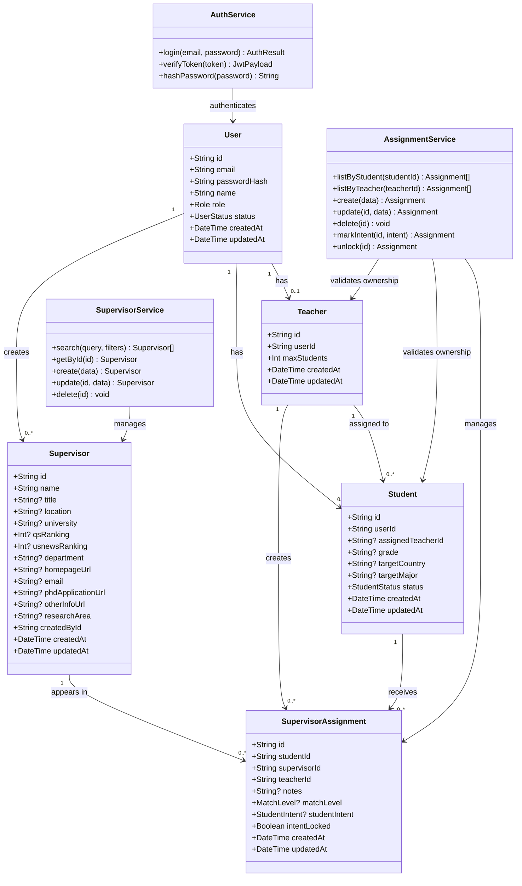
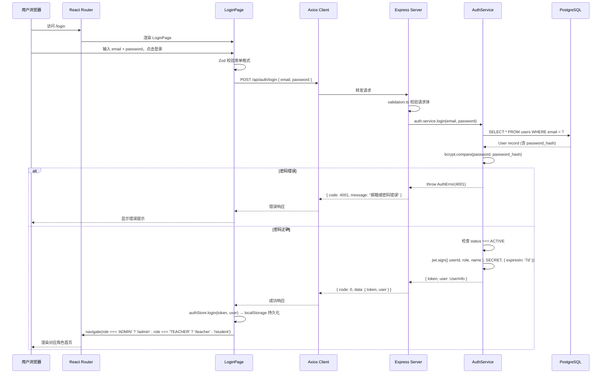
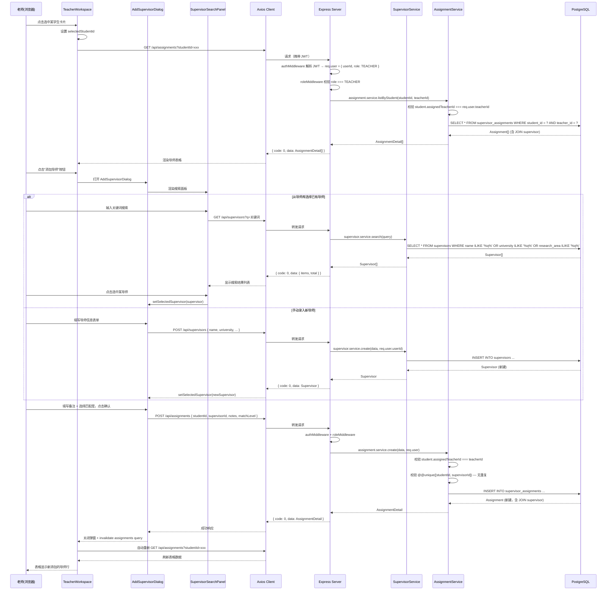
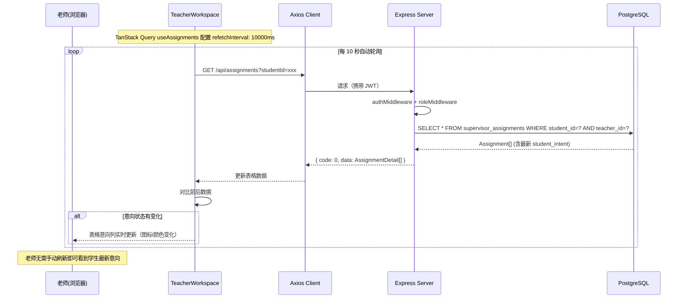
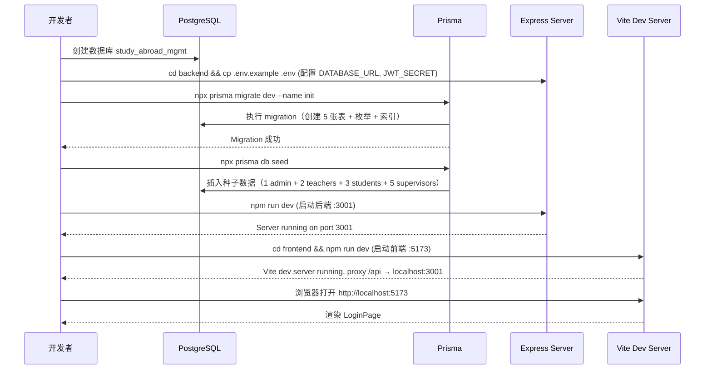
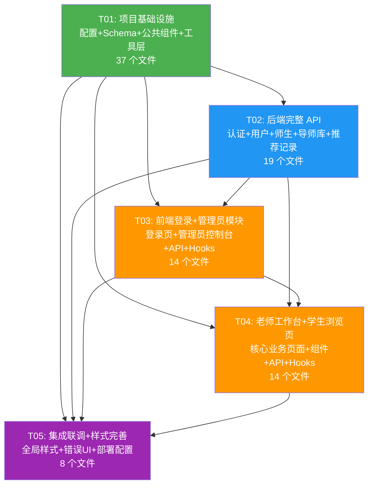

# 系统架构设计文档：留学机构学生与选导管理系统

> **项目名称**：study_abroad_mgmt  
> **架构师**：Bob  
> **版本**：v1.0  
> **日期**：2025-07-10  
> **基于 PRD**：v1.0

---

## 目录

- [Part A：系统设计](#part-a系统设计)
  - [1. 实现方案与框架选型](#1-实现方案与框架选型)
  - [2. 文件列表及相对路径](#2-文件列表及相对路径)
  - [3. 数据结构和接口](#3-数据结构和接口)
  - [4. 程序调用流程](#4-程序调用流程)
  - [5. 待明确事项](#5-待明确事项)
- [Part B：任务分解](#part-b任务分解)
  - [6. 依赖包列表](#6-依赖包列表)
  - [7. 任务列表](#7-任务列表有序含依赖关系)
  - [8. 共享知识](#8-共享知识跨文件约定)
  - [9. 任务依赖图](#9-任务依赖图)

---

## Part A：系统设计

### 1. 实现方案与框架选型

#### 1.1 核心技术挑战分析

| 挑战 | 说明 | 解决方案 |
|------|------|---------|
| **三角色权限隔离** | 管理员/老师/学生有不同的数据可见性和操作权限 | JWT 携带 role 声明 + 后端中间件层角色校验 + 前端路由守卫 |
| **导师库全局共享与推荐记录分离** | Supervisor 全局共享，Assignment 是学生×导师的关联记录 | 数据模型层 Supervisor 与 SupervisorAssignment 分表，Assignment 通过 FK 关联 |
| **意向锁定机制** | 学生标记"想联系/备选"后锁定，"跳过"不锁定；老师可解锁 | Assignment.intent_locked 布尔字段 + 业务逻辑层判断 |
| **老师工作台实时反馈** | 老师需实时看到学生意向变化 | TanStack Query 轮询机制（10s 间隔），MVP 阶段不引入 WebSocket |
| **备注匹配度解析** | 从备注文本中解析匹配度标识并高亮 | 后端存储 match_level 枚举 + notes 原文；前端根据 match_level 渲染颜色标签 |

#### 1.2 后端框架选型

| 决策项 | 选择 | 理由 |
|--------|------|------|
| **运行时** | Node.js 20 LTS | 成熟稳定，与前端共享 TypeScript 生态 |
| **Web 框架** | Express 4 | 轻量灵活，社区生态丰富，适合中小型 CRUD 项目 |
| **ORM** | Prisma 5 | 一流的 TypeScript 支持，自动类型推导，Migration 管理完善，Schema 即文档 |
| **认证** | JWT (jsonwebtoken) | 无状态认证，三角色通过 token payload 中的 role 字段区分 |
| **密码哈希** | bcrypt | 行业标准，抗彩虹表攻击 |
| **参数校验** | Zod | TypeScript 优先的 schema 校验，与 Prisma 类型互补 |
| **CORS** | cors 中间件 | 开发环境允许前端 localhost 跨域 |
| **日志** | morgan | HTTP 请求日志中间件 |

#### 1.3 前端框架选型

| 决策项 | 选择 | 理由 |
|--------|------|------|
| **构建工具** | Vite 5 | 极速 HMR，开箱即用的 TypeScript 支持 |
| **UI 框架** | React 18 | 生态成熟，团队熟悉 |
| **组件库** | MUI 5 (Material-UI) | PRD 指定，组件丰富，DataGrid 适合老师工作台表格 |
| **CSS 方案** | Tailwind CSS 3 | PRD 指定，与 MUI 共存，用于布局微调和自定义样式 |
| **路由** | React Router 6 | 声明式路由，支持嵌套路由和路由守卫 |
| **客户端状态** | Zustand | 轻量无样板，适合管理 auth 状态和 UI 状态 |
| **服务端状态** | TanStack Query (React Query) 5 | 自动缓存、轮询、失效重取，适合老师工作台实时反馈场景 |
| **HTTP 客户端** | Axios | 拦截器机制统一处理 token 注入和错误处理 |
| **表单管理** | React Hook Form + Zod | 性能优化好，与后端 Zod schema 复用 |
| **图标** | @mui/icons-material + lucide-react | MUI 自带图标 + lucide 补充 |
| **通知** | Sonner | 轻量 toast 通知 |

#### 1.4 认证方案（JWT 细节）

```
登录流程：
1. 用户提交 email + password → POST /api/auth/login
2. 后端校验密码 (bcrypt.compare)
3. 生成 JWT: { userId, role, name }，有效期 7 天
4. 返回 { token, user: { id, name, role, email } }
5. 前端存储 token 到 localStorage，user 信息到 Zustand store

请求鉴权：
1. Axios 请求拦截器自动注入 Authorization: Bearer <token>
2. 后端 authMiddleware 解析 JWT，挂载 req.user = { userId, role, name }
3. roleMiddleware 检查 req.user.role 是否在允许列表中

路由守卫：
1. ProtectedRoute 组件检查 Zustand authStore 中的 token 和 role
2. 未登录 → 重定向 /login
3. 角色不匹配 → 重定向到对应角色首页
```

#### 1.5 前端路由结构

```
/login                              → LoginPage (公开)
/admin                              → AdminDashboard (role: admin)
  /admin/users                      → UserManagement (老师管理 + 学生管理 Tab)
/teacher                            → TeacherWorkspace (role: teacher)
/student                            → StudentBrowsePage (role: student)
*                                   → 重定向到角色首页
```

#### 1.6 前端状态管理方案

| 状态类型 | 管理工具 | 示例 |
|---------|---------|------|
| **认证状态** | Zustand (authStore) + localStorage 持久化 | currentUser, token, isAuthenticated |
| **服务端数据** | TanStack Query | 导师列表、推荐记录、学生列表 |
| **UI 交互状态** | 组件局部 useState | 弹窗开关、选中项、筛选条件 |
| **全局 UI 状态** | Zustand (uiStore) | 全局 loading、主题（可选） |

#### 1.7 项目目录结构

```
轻学新系统/
├── architecture.md                  ← 本文档
├── prd.md                           ← 产品需求文档
├── docs/                            ← 架构辅助文档
│   ├── class-diagram.mermaid
│   └── sequence-diagram.mermaid
├── backend/                         ← 后端项目
│   ├── prisma/
│   │   ├── schema.prisma            ← 数据库 Schema
│   │   └── seed.ts                  ← 种子数据
│   ├── src/
│   │   ├── config/
│   │   │   └── index.ts             ← 配置（端口、JWT密钥、DB连接）
│   │   ├── middleware/
│   │   │   ├── auth.ts              ← JWT 验证中间件
│   │   │   ├── role.ts              ← 角色权限中间件
│   │   │   └── error.ts             ← 全局错误处理
│   │   ├── routes/
│   │   │   ├── auth.routes.ts
│   │   │   ├── user.routes.ts
│   │   │   ├── student.routes.ts
│   │   │   ├── teacher.routes.ts
│   │   │   ├── supervisor.routes.ts
│   │   │   └── assignment.routes.ts
│   │   ├── controllers/
│   │   │   ├── auth.controller.ts
│   │   │   ├── user.controller.ts
│   │   │   ├── student.controller.ts
│   │   │   ├── teacher.controller.ts
│   │   │   ├── supervisor.controller.ts
│   │   │   └── assignment.controller.ts
│   │   ├── services/
│   │   │   ├── auth.service.ts
│   │   │   ├── user.service.ts
│   │   │   ├── student.service.ts
│   │   │   ├── teacher.service.ts
│   │   │   ├── supervisor.service.ts
│   │   │   └── assignment.service.ts
│   │   ├── utils/
│   │   │   ├── response.ts          ← 统一响应格式
│   │   │   ├── jwt.ts               ← JWT 签发/验证
│   │   │   └── validation.ts        ← Zod schemas
│   │   ├── types/
│   │   │   └── index.ts             ← 共享类型定义
│   │   ├── app.ts                   ← Express 应用配置
│   │   └── index.ts                 ← 入口文件
│   ├── package.json
│   ├── tsconfig.json
│   └── .env.example
├── frontend/                        ← 前端项目
│   ├── src/
│   │   ├── api/                     ← API 请求层
│   │   │   ├── client.ts            ← Axios 实例 + 拦截器
│   │   │   ├── auth.ts
│   │   │   ├── users.ts
│   │   │   ├── students.ts
│   │   │   ├── teachers.ts
│   │   │   ├── supervisors.ts
│   │   │   └── assignments.ts
│   │   ├── components/
│   │   │   ├── common/              ← 公共组件
│   │   │   │   ├── Layout.tsx
│   │   │   │   ├── ProtectedRoute.tsx
│   │   │   │   ├── StatusBadge.tsx
│   │   │   │   └── ConfirmDialog.tsx
│   │   │   ├── auth/
│   │   │   │   └── LoginForm.tsx
│   │   │   ├── admin/
│   │   │   │   ├── TeacherManageTab.tsx
│   │   │   │   ├── StudentManageTab.tsx
│   │   │   │   ├── AssignDialog.tsx
│   │   │   │   └── StatCards.tsx
│   │   │   ├── teacher/
│   │   │   │   ├── StudentCard.tsx
│   │   │   │   ├── SupervisorTable.tsx
│   │   │   │   ├── AddSupervisorDialog.tsx
│   │   │   │   ├── SupervisorSearchPanel.tsx
│   │   │   │   └── EditAssignmentDialog.tsx
│   │   │   └── student/
│   │   │       ├── ProgressBar.tsx
│   │   │       ├── FilterTabs.tsx
│   │   │       ├── SupervisorCard.tsx
│   │   │       └── IntentButtons.tsx
│   │   ├── pages/
│   │   │   ├── LoginPage.tsx
│   │   │   ├── admin/
│   │   │   │   └── AdminDashboard.tsx
│   │   │   ├── teacher/
│   │   │   │   └── TeacherWorkspace.tsx
│   │   │   └── student/
│   │   │       └── StudentBrowsePage.tsx
│   │   ├── hooks/
│   │   │   ├── useAuth.ts
│   │   │   ├── useStudents.ts
│   │   │   ├── useSupervisors.ts
│   │   │   └── useAssignments.ts
│   │   ├── store/
│   │   │   ├── authStore.ts
│   │   │   └── uiStore.ts
│   │   ├── router/
│   │   │   └── index.tsx
│   │   ├── types/
│   │   │   └── index.ts
│   │   ├── utils/
│   │   │   ├── constants.ts
│   │   │   └── helpers.ts
│   │   ├── App.tsx
│   │   └── main.tsx
│   ├── index.html
│   ├── package.json
│   ├── tsconfig.json
│   ├── vite.config.ts
│   └── tailwind.config.ts
```

---

### 2. 文件列表及相对路径

#### 2.1 后端文件列表

| 文件路径 | 职责 |
|---------|------|
| `backend/package.json` | 后端依赖声明与脚本 |
| `backend/tsconfig.json` | TypeScript 编译配置 |
| `backend/.env.example` | 环境变量模板 |
| `backend/prisma/schema.prisma` | Prisma 数据库 Schema（5 个模型 + 4 个枚举） |
| `backend/prisma/seed.ts` | 种子数据：1 个管理员 + 2 个老师 + 3 个学生 + 5 个导师 |
| `backend/src/index.ts` | 服务启动入口，监听端口 |
| `backend/src/app.ts` | Express 应用配置：CORS、JSON 解析、路由挂载、错误处理 |
| `backend/src/config/index.ts` | 环境变量读取与校验（端口、JWT_SECRET、DATABASE_URL） |
| `backend/src/middleware/auth.ts` | JWT 验证中间件，解析 token 并挂载 req.user |
| `backend/src/middleware/role.ts` | 角色权限中间件，检查 req.user.role 是否允许 |
| `backend/src/middleware/error.ts` | 全局错误处理中间件，统一错误响应格式 |
| `backend/src/routes/auth.routes.ts` | 认证路由定义 |
| `backend/src/routes/user.routes.ts` | 用户管理路由（管理员） |
| `backend/src/routes/student.routes.ts` | 学生路由（管理员/老师/学生） |
| `backend/src/routes/teacher.routes.ts` | 老师路由（管理员/老师） |
| `backend/src/routes/supervisor.routes.ts` | 导师库路由（管理员/老师） |
| `backend/src/routes/assignment.routes.ts` | 推荐记录路由（老师/学生） |
| `backend/src/controllers/auth.controller.ts` | 登录、获取当前用户 |
| `backend/src/controllers/user.controller.ts` | 用户 CRUD |
| `backend/src/controllers/student.controller.ts` | 学生 CRUD + 师生分配 |
| `backend/src/controllers/teacher.controller.ts` | 老师 CRUD |
| `backend/src/controllers/supervisor.controller.ts` | 导师库 CRUD + 搜索 |
| `backend/src/controllers/assignment.controller.ts` | 推荐记录 CRUD + 意向标记 + 解锁 |
| `backend/src/services/auth.service.ts` | 密码校验、JWT 签发 |
| `backend/src/services/user.service.ts` | 用户数据库操作 |
| `backend/src/services/student.service.ts` | 学生数据库操作 + 分配逻辑 |
| `backend/src/services/teacher.service.ts` | 老师数据库操作 |
| `backend/src/services/supervisor.service.ts` | 导师库数据库操作 + 搜索逻辑 |
| `backend/src/services/assignment.service.ts` | 推荐记录数据库操作 + 意向锁定逻辑 |
| `backend/src/utils/response.ts` | 统一响应封装：success(data)、error(code, message) |
| `backend/src/utils/jwt.ts` | JWT 签发与验证工具函数 |
| `backend/src/utils/validation.ts` | Zod schema 定义（loginSchema、createUserSchema 等） |
| `backend/src/types/index.ts` | 后端共享类型（AuthedRequest、ApiResponse 等） |

#### 2.2 前端文件列表

| 文件路径 | 职责 |
|---------|------|
| `frontend/package.json` | 前端依赖声明与脚本 |
| `frontend/tsconfig.json` | TypeScript 配置 |
| `frontend/vite.config.ts` | Vite 配置（代理 /api 到后端） |
| `frontend/tailwind.config.ts` | Tailwind 配置 |
| `frontend/index.html` | HTML 入口 |
| `frontend/src/main.tsx` | React 入口，挂载 App + QueryClientProvider + ThemeProvider |
| `frontend/src/App.tsx` | 根组件，包裹 RouterProvider |
| `frontend/src/router/index.tsx` | 路由配置（ProtectedRoute + 各角色路由） |
| `frontend/src/types/index.ts` | 前端共享类型（User、Student、Supervisor、Assignment 等） |
| `frontend/src/utils/constants.ts` | 常量定义（角色、意向状态、匹配度标签、颜色映射） |
| `frontend/src/utils/helpers.ts` | 工具函数（排名格式化、匹配度解析、日期格式化） |
| `frontend/src/api/client.ts` | Axios 实例 + 请求/响应拦截器 |
| `frontend/src/api/auth.ts` | 认证 API（login、getMe） |
| `frontend/src/api/users.ts` | 用户管理 API（list、create、update、toggleStatus） |
| `frontend/src/api/teachers.ts` | 老师 API（list、get、create、update） |
| `frontend/src/api/students.ts` | 学生 API（list、get、create、update、assign） |
| `frontend/src/api/supervisors.ts` | 导师库 API（list/search、get、create、update、delete） |
| `frontend/src/api/assignments.ts` | 推荐记录 API（list、create、update、delete、markIntent、unlock） |
| `frontend/src/store/authStore.ts` | Zustand auth 状态（user、token、login、logout） |
| `frontend/src/store/uiStore.ts` | Zustand UI 状态（全局 loading、toast） |
| `frontend/src/hooks/useAuth.ts` | 认证 hook（封装 authStore + auth API） |
| `frontend/src/hooks/useStudents.ts` | 学生数据 hook（TanStack Query 封装） |
| `frontend/src/hooks/useSupervisors.ts` | 导师数据 hook（搜索、创建） |
| `frontend/src/hooks/useAssignments.ts` | 推荐记录 hook（列表、意向标记、轮询） |
| `frontend/src/components/common/Layout.tsx` | 通用布局壳（顶栏 + 内容区 + 角色信息） |
| `frontend/src/components/common/ProtectedRoute.tsx` | 路由守卫（鉴权 + 角色检查） |
| `frontend/src/components/common/StatusBadge.tsx` | 状态徽章组件（搜索中/待反馈/已反馈） |
| `frontend/src/components/common/ConfirmDialog.tsx` | 通用确认弹窗 |
| `frontend/src/components/auth/LoginForm.tsx` | 登录表单（邮箱 + 密码 + 提交） |
| `frontend/src/components/admin/StatCards.tsx` | 管理员统计卡片组 |
| `frontend/src/components/admin/TeacherManageTab.tsx` | 老师管理 Tab（列表 + 添加/编辑弹窗） |
| `frontend/src/components/admin/StudentManageTab.tsx` | 学生管理 Tab（列表 + 添加/分配弹窗） |
| `frontend/src/components/admin/AssignDialog.tsx` | 师生分配弹窗（选择老师） |
| `frontend/src/components/teacher/StudentCard.tsx` | 学生卡片（姓名 + 导师数 + 状态徽章） |
| `frontend/src/components/teacher/SupervisorTable.tsx` | 导师紧凑表格（MUI DataGrid） |
| `frontend/src/components/teacher/AddSupervisorDialog.tsx` | 添加导师弹窗（搜索库 + 新建表单） |
| `frontend/src/components/teacher/SupervisorSearchPanel.tsx` | 导师搜索面板（模糊匹配） |
| `frontend/src/components/teacher/EditAssignmentDialog.tsx` | 编辑推荐记录弹窗（备注 + 匹配度） |
| `frontend/src/components/student/ProgressBar.tsx` | 进度统计栏（想联系/备选/待查看） |
| `frontend/src/components/student/FilterTabs.tsx` | 筛选标签栏 |
| `frontend/src/components/student/SupervisorCard.tsx` | 导师卡片（信息 + 匹配度 + 链接 + 三态按钮） |
| `frontend/src/components/student/IntentButtons.tsx` | 三态意向按钮组件 |
| `frontend/src/pages/LoginPage.tsx` | 登录页 |
| `frontend/src/pages/admin/AdminDashboard.tsx` | 管理员控制台（统计 + 老师/学生管理 Tab） |
| `frontend/src/pages/teacher/TeacherWorkspace.tsx` | 老师工作台（左学生列表 + 右导师表格） |
| `frontend/src/pages/student/StudentBrowsePage.tsx` | 学生导师浏览页（统计栏 + 筛选 + 卡片网格） |

---

### 3. 数据结构和接口

#### 3.1 数据库 Schema（Prisma）

```prisma
// backend/prisma/schema.prisma

generator client {
  provider = "prisma-client-js"
}

datasource db {
  provider = "postgresql"
  url      = env("DATABASE_URL")
}

// ==================== 枚举 ====================

enum Role {
  ADMIN
  TEACHER
  STUDENT
}

enum UserStatus {
  ACTIVE
  DISABLED
}

enum StudentStatus {
  ACTIVE
  GRADUATED
  PAUSED
}

enum MatchLevel {
  HIGH      // "建议多看看" — 绿色
  MEDIUM    // "可以备选" — 黄色
}

enum StudentIntent {
  WANT_CONTACT  // 想联系
  BACKUP        // 备选
  SKIP          // 跳过
}

// ==================== 模型 ====================

model User {
  id           String     @id @default(uuid())
  email        String     @unique
  passwordHash String     @map("password_hash")
  name         String
  role         Role
  status       UserStatus @default(ACTIVE)
  createdAt    DateTime   @default(now()) @map("created_at")
  updatedAt    DateTime   @updatedAt      @map("updated_at")

  teacher              Teacher?
  student              Student?
  createdSupervisors   Supervisor[]

  @@map("users")
}

model Teacher {
  id          String    @id @default(uuid())
  userId      String    @unique @map("user_id")
  user        User      @relation(fields: [userId], references: [id], onDelete: Cascade)
  maxStudents Int       @default(20) @map("max_students")
  createdAt   DateTime  @default(now()) @map("created_at")
  updatedAt   DateTime  @updatedAt      @map("updated_at")

  students    Student[]
  assignments SupervisorAssignment[]

  @@map("teachers")
}

model Student {
  id                String         @id @default(uuid())
  userId            String         @unique @map("user_id")
  user              User           @relation(fields: [userId], references: [id], onDelete: Cascade)
  assignedTeacherId String?        @map("assigned_teacher_id")
  assignedTeacher   Teacher?       @relation(fields: [assignedTeacherId], references: [id])
  grade             String?
  targetCountry     String?        @map("target_country")
  targetMajor       String?        @map("target_major")
  status            StudentStatus  @default(ACTIVE)
  createdAt         DateTime       @default(now()) @map("created_at")
  updatedAt         DateTime       @updatedAt      @map("updated_at")

  assignments       SupervisorAssignment[]

  @@map("students")
}

model Supervisor {
  id                String   @id @default(uuid())
  name              String
  title             String?
  location          String?
  university        String?
  qsRanking         Int?     @map("qs_ranking")
  usnewsRanking     Int?     @map("usnews_ranking")
  department        String?
  homepageUrl       String?  @map("homepage_url")
  email             String?
  phdApplicationUrl String?  @map("phd_application_url")
  otherInfoUrl      String?  @map("other_info_url")
  researchArea      String?  @map("research_area")
  createdById       String   @map("created_by")
  createdBy         User     @relation(fields: [createdById], references: [id])
  createdAt         DateTime @default(now()) @map("created_at")
  updatedAt         DateTime @updatedAt      @map("updated_at")

  assignments       SupervisorAssignment[]

  @@index([name])
  @@index([university])
  @@index([researchArea])
  @@map("supervisors")
}

model SupervisorAssignment {
  id            String         @id @default(uuid())
  studentId     String         @map("student_id")
  student       Student        @relation(fields: [studentId], references: [id], onDelete: Cascade)
  supervisorId  String         @map("supervisor_id")
  supervisor    Supervisor     @relation(fields: [supervisorId], references: [id])
  teacherId     String         @map("teacher_id")
  teacher       Teacher        @relation(fields: [teacherId], references: [id])
  notes         String?
  matchLevel    MatchLevel?    @map("match_level")
  studentIntent StudentIntent? @map("student_intent")
  intentLocked  Boolean        @default(false) @map("intent_locked")
  createdAt     DateTime       @default(now()) @map("created_at")
  updatedAt     DateTime       @updatedAt      @map("updated_at")

  @@unique([studentId, supervisorId])
  @@index([studentId])
  @@index([teacherId])
  @@index([supervisorId])
  @@map("supervisor_assignments")
}
```

#### 3.2 类关系图



#### 3.3 API 接口列表

##### 统一响应格式

```typescript
// 成功响应
{
  "code": 0,
  "data": T,
  "message": "success"
}

// 错误响应
{
  "code": 4001,  // 业务错误码
  "data": null,
  "message": "邮箱或密码错误"
}
```

##### 认证接口

| Method | Path | 角色 | 请求体 | 响应 data |
|--------|------|------|--------|----------|
| POST | `/api/auth/login` | 公开 | `{ email: string, password: string }` | `{ token: string, user: UserInfo }` |
| GET | `/api/auth/me` | 已登录 | — | `UserInfo` |

```typescript
// UserInfo 类型
interface UserInfo {
  id: string;
  email: string;
  name: string;
  role: 'ADMIN' | 'TEACHER' | 'STUDENT';
  status: 'ACTIVE' | 'DISABLED';
}
```

##### 用户管理接口

| Method | Path | 角色 | 请求体 | 响应 data |
|--------|------|------|--------|----------|
| GET | `/api/users` | Admin | Query: `role?, status?, page?, pageSize?` | `{ items: UserInfo[], total: number }` |
| POST | `/api/users` | Admin | `{ email, password, name, role }` | `UserInfo` |
| PUT | `/api/users/:id` | Admin | `{ name?, email?, password? }` | `UserInfo` |
| PATCH | `/api/users/:id/status` | Admin | `{ status: 'ACTIVE' \| 'DISABLED' }` | `UserInfo` |

##### 老师接口

| Method | Path | 角色 | 请求体 | 响应 data |
|--------|------|------|--------|----------|
| GET | `/api/teachers` | Admin, Teacher | — | `TeacherWithCount[]` |
| GET | `/api/teachers/:id` | Admin, Teacher | — | `TeacherDetail` |
| POST | `/api/teachers` | Admin | `{ userId, maxStudents? }` | `Teacher` |
| PUT | `/api/teachers/:id` | Admin, Teacher | `{ maxStudents? }` | `Teacher` |
| GET | `/api/teachers/:id/students` | Admin, Teacher(self) | — | `StudentSummary[]` |

```typescript
interface TeacherWithCount {
  id: string;
  userId: string;
  name: string;
  email: string;
  maxStudents: number;
  studentCount: number;
  status: UserStatus;
}

interface TeacherDetail extends TeacherWithCount {
  students: StudentSummary[];
}

interface StudentSummary {
  id: string;
  name: string;
  grade: string | null;
  targetCountry: string | null;
  targetMajor: string | null;
  status: StudentStatus;
  assignmentCount: number;
  feedbackStatus: 'SEARCHING' | 'PENDING' | 'DONE';
}
```

##### 学生接口

| Method | Path | 角色 | 请求体 | 响应 data |
|--------|------|------|--------|----------|
| GET | `/api/students` | Admin(all), Teacher(assigned), Student(own) | Query: `teacherId?` | `StudentSummary[]` |
| GET | `/api/students/:id` | Admin, Teacher(assigned), Student(own) | — | `StudentDetail` |
| POST | `/api/students` | Admin | `{ userId, grade?, targetCountry?, targetMajor? }` | `Student` |
| PUT | `/api/students/:id` | Admin, Student(own) | `{ grade?, targetCountry?, targetMajor? }` | `Student` |
| PATCH | `/api/students/:id/assign` | Admin | `{ teacherId: string \| null }` | `Student` |

```typescript
interface StudentDetail {
  id: string;
  userId: string;
  name: string;
  email: string;
  grade: string | null;
  targetCountry: string | null;
  targetMajor: string | null;
  status: StudentStatus;
  assignedTeacher: { id: string; name: string } | null;
  assignmentCount: number;
  feedbackStatus: 'SEARCHING' | 'PENDING' | 'DONE';
}
```

##### 导师库接口

| Method | Path | 角色 | 请求体 | 响应 data |
|--------|------|------|--------|----------|
| GET | `/api/supervisors` | Admin, Teacher | Query: `q?, university?, researchArea?, sortBy?(qs_ranking\|usnews_ranking\|name), sortOrder?(asc\|desc), page?, pageSize?` | `{ items: Supervisor[], total: number }` |
| GET | `/api/supervisors/:id` | Admin, Teacher | — | `Supervisor` |
| POST | `/api/supervisors` | Admin, Teacher | `CreateSupervisorInput` | `Supervisor` |
| PUT | `/api/supervisors/:id` | Admin, Teacher | `UpdateSupervisorInput` | `Supervisor` |
| DELETE | `/api/supervisors/:id` | Admin | — | `{ success: true }` |

```typescript
interface Supervisor {
  id: string;
  name: string;
  title: string | null;
  location: string | null;
  university: string | null;
  qsRanking: number | null;
  usnewsRanking: number | null;
  department: string | null;
  homepageUrl: string | null;
  email: string | null;
  phdApplicationUrl: string | null;
  otherInfoUrl: string | null;
  researchArea: string | null;
  createdById: string;
  createdByName: string;
  createdAt: string;
  updatedAt: string;
}

interface CreateSupervisorInput {
  name: string;               // 必填
  title?: string;
  location?: string;
  university?: string;
  qsRanking?: number;
  usnewsRanking?: number;
  department?: string;
  homepageUrl?: string;
  email?: string;
  phdApplicationUrl?: string;
  otherInfoUrl?: string;
  researchArea?: string;
}
```

##### 推荐记录接口

| Method | Path | 角色 | 请求体 | 响应 data |
|--------|------|------|--------|----------|
| GET | `/api/assignments` | Admin(all), Teacher(own), Student(own) | Query: `studentId?, teacherId?, intent?` | `AssignmentDetail[]` |
| POST | `/api/assignments` | Teacher | `{ studentId, supervisorId, notes?, matchLevel? }` | `AssignmentDetail` |
| PUT | `/api/assignments/:id` | Teacher(own) | `{ notes?, matchLevel? }` | `AssignmentDetail` |
| DELETE | `/api/assignments/:id` | Teacher(own) | — | `{ success: true }` |
| PATCH | `/api/assignments/:id/intent` | Student(own) | `{ intent: 'WANT_CONTACT' \| 'BACKUP' \| 'SKIP' }` | `AssignmentDetail` |
| PATCH | `/api/assignments/:id/unlock` | Teacher(own) | — | `AssignmentDetail` |

```typescript
interface AssignmentDetail {
  id: string;
  studentId: string;
  studentName: string;
  supervisorId: string;
  supervisor: Supervisor;  // 嵌套导师完整信息
  teacherId: string;
  teacherName: string;
  notes: string | null;
  matchLevel: 'HIGH' | 'MEDIUM' | null;
  matchLevelLabel: string | null;  // "建议多看看" / "可以备选"
  studentIntent: 'WANT_CONTACT' | 'BACKUP' | 'SKIP' | null;
  intentLabel: string | null;      // "想联系" / "备选" / "跳过"
  intentLocked: boolean;
  createdAt: string;
  updatedAt: string;
}
```

##### 统计接口

| Method | Path | 角色 | 响应 data |
|--------|------|------|----------|
| GET | `/api/stats/overview` | Admin | `{ totalStudents, totalTeachers, totalSupervisors, totalAssignments, avgAssignmentsPerStudent, feedbackRate }` |

#### 3.4 前端页面组件树

```
App
└── RouterProvider
    ├── LoginPage
    │   └── LoginForm
    ├── ProtectedRoute (role: ADMIN)
    │   └── Layout
    │       └── AdminDashboard
    │           ├── StatCards                    ← 统计概览
    │           └── Tabs
    │               ├── TeacherManageTab         ← 老师管理
    │               │   ├── TeacherList
    │               │   └── UserCreateDialog
    │               └── StudentManageTab         ← 学生管理
    │                   ├── StudentTable
    │                   ├── UserCreateDialog
    │                   └── AssignDialog         ← 师生分配
    ├── ProtectedRoute (role: TEACHER)
    │   └── Layout
    │       └── TeacherWorkspace
    │           ├── TopBar
    │           │   ├── SupervisorSearchPanel    ← 搜索导师入口
    │           │   └── AddSupervisorDialog      ← 添加导师弹窗
    │           ├── StudentList (左侧)
    │           │   └── StudentCard × N          ← 学生卡片+状态徽章
    │           └── SupervisorTable (右侧)        ← MUI DataGrid
    │               └── EditAssignmentDialog     ← 编辑备注弹窗
    └── ProtectedRoute (role: STUDENT)
        └── Layout
            └── StudentBrowsePage
                ├── ProgressBar                  ← 想联系 X / 备选 Y / 待查看 Z
                ├── FilterTabs                   ← 全部/想联系/备选/暂不考虑
                └── SupervisorCardGrid           ← 卡片网格
                    └── SupervisorCard × N
                        ├── CardHeader           ← 姓名+职称
                        ├── CardInfo             ← 学校+排名+地区
                        ├── MatchLevelBadge      ← 匹配度高亮
                        ├── CardNotes            ← 备注摘要
                        ├── CardLinks            ← 主页/邮箱/申请链接
                        └── IntentButtons        ← 三态按钮
```

#### 3.5 错误码定义

| 错误码 | 含义 | HTTP Status |
|--------|------|-------------|
| 0 | 成功 | 200 |
| 4001 | 邮箱或密码错误 | 401 |
| 4002 | Token 无效或过期 | 401 |
| 4003 | 权限不足 | 403 |
| 4004 | 资源不存在 | 404 |
| 4005 | 邮箱已存在 | 409 |
| 4006 | 参数校验失败 | 422 |
| 4007 | 推荐记录已存在（重复推荐） | 409 |
| 4008 | 意向已锁定 | 409 |
| 4009 | 学生已分配老师 | 409 |
| 5000 | 服务器内部错误 | 500 |

---

### 4. 程序调用流程

#### 4.1 登录认证流程



#### 4.2 老师添加导师到学生推荐列表流程



#### 4.3 学生标记意向流程

```mermaid
sequenceDiagram
    participant S as 学生(浏览器)
    participant SBP as StudentBrowsePage
    participant SC as SupervisorCard
    participant IB as IntentButtons
    participant API as Axios Client
    participant BE as Express Server
    participant APS as AssignmentService
    participant DB as PostgreSQL

    S->>SBP: 访问 /student
    SBP->>API: GET /api/assignments (studentId = own)
    API->>BE: 请求（携带 JWT）
    BE->>BE: authMiddleware → req.user = { userId, role: STUDENT }
    BE->>BE: roleMiddleware 校验 role === STUDENT
    BE->>APS: assignment.service.listByStudent(studentId, studentId)
    APS->>DB: SELECT * FROM supervisor_assignments WHERE student_id = ?
    DB-->>APS: Assignment[] (含 JOIN supervisor)
    APS-->>BE: AssignmentDetail[]
    BE-->>API: { code: 0, data: AssignmentDetail[] }
    API-->>SBP: 渲染卡片网格 + 进度统计栏

    S->>SC: 查看某导师卡片
    SC->>IB: 渲染三态按钮（检查 intentLocked）
    alt intentLocked === true
        IB->>IB: 高亮当前意向按钮，禁用其他按钮
        IB-->>S: 显示"已锁定"状态
    else intentLocked === false
        IB-->>S: 三个按钮可点击
        S->>IB: 点击"想联系"
        IB->>IB: 乐观更新 UI（按钮高亮）
        IB->>API: PATCH /api/assignments/:id/intent { intent: 'WANT_CONTACT' }
        API->>BE: 转发请求
        BE->>BE: authMiddleware + roleMiddleware
        BE->>APS: assignment.service.markIntent(id, 'WANT_CONTACT', req.user)
        APS->>DB: SELECT * FROM supervisor_assignments WHERE id = ?
        DB-->>APS: Assignment
        APS->>APS: 校验 assignment.studentId === student.userId 对应的 student.id
        APS->>APS: 检查 intentLocked === false
        alt intentLocked === true
            APS-->>BE: throw ConflictError(4008, "意向已锁定")
            BE-->>API: { code: 4008, message: "意向已锁定" }
            API-->>IB: 错误响应
            IB->>IB: 回滚乐观更新
            IB-->>S: 显示"该导师意向已锁定，请联系老师"
        else intentLocked === false
            APS->>APS: 更新 studentIntent = 'WANT_CONTACT', intentLocked = true
            APS->>DB: UPDATE supervisor_assignments SET student_intent='WANT_CONTACT', intent_locked=true WHERE id=?
            DB-->>APS: 更新成功
            APS->>DB: SELECT * (重新查询含 JOIN)
            DB-->>APS: AssignmentDetail
            APS-->>BE: AssignmentDetail
            BE-->>API: { code: 0, data: AssignmentDetail }
            API-->>IB: 成功响应
            IB->>IB: 确认乐观更新，锁定按钮
            IB-->>S: 显示"已标记为想联系" + 按钮锁定
        end
    end

    Note over SBP: TanStack Query invalidate → 重新获取 assignments
    SBP->>API: 自动 GET /api/assignments (refetch)
    API->>>SBP: 更新进度统计栏 (想联系 +1)
```

#### 4.4 老师查看学生意向反馈流程（轮询）



#### 4.5 初始化流程（服务启动）



---

### 5. 待明确事项

| 编号 | 问题 | 当前假设 | 影响范围 |
|------|------|---------|---------|
| U-01 | 部署环境未确定（Docker? 传统部署?） | 假设本地开发为主，后续 Docker 化 | 部署脚本、环境变量管理 |
| U-02 | PostgreSQL 实例的版本和连接信息未提供 | 假设 PostgreSQL 15+，本地 localhost:5432 | schema.prisma datasource 配置 |
| U-03 | 前端是否需要暗色模式支持 | MVP 阶段仅亮色模式 | ThemeProvider 配置 |
| U-04 | 密码复杂度策略 | 假设最少 8 位，包含字母和数字 | Zod validation schema |
| U-05 | 老师工作台轮询间隔 10s 是否可接受 | 假设可接受，后续可改为 WebSocket | useAssignments hook 的 refetchInterval |
| U-06 | 管理员是否可查看单个学生的推荐详情 | 假设管理员可查看全局推荐记录列表，但不进入老师工作台 | assignment 路由权限 |
| U-07 | 导师搜索是否需要分页 | 假设前端搜索面板为即时搜索（debounce 300ms），不分页；导师库列表页支持分页 | API 设计 |
| U-08 | 管理员创建用户时是否需要同时创建 Teacher/Student 关联记录 | 假设创建用户时选择角色后，自动创建对应 Teacher 或 Student 记录 | user.service + teacher.service + student.service 协同 |

---

## Part B：任务分解

### 6. 依赖包列表

#### 6.1 后端依赖

```json
{
  "dependencies": {
    "express": "^4.19.2",
    "@prisma/client": "^5.18.0",
    "jsonwebtoken": "^9.0.2",
    "bcryptjs": "^2.4.3",
    "zod": "^3.23.8",
    "cors": "^2.8.5",
    "morgan": "^1.10.0",
    "dotenv": "^16.4.5"
  },
  "devDependencies": {
    "prisma": "^5.18.0",
    "typescript": "^5.5.4",
    "@types/express": "^4.17.21",
    "@types/jsonwebtoken": "^9.0.6",
    "@types/bcryptjs": "^2.4.6",
    "@types/cors": "^2.8.17",
    "@types/morgan": "^1.9.9",
    "tsx": "^4.16.0",
    "ts-node": "^10.9.2"
  }
}
```

| 包名 | 用途 |
|------|------|
| `express` | Web 框架 |
| `@prisma/client` | ORM 客户端 |
| `prisma` | ORM CLI（migration、seed） |
| `jsonwebtoken` | JWT 签发与验证 |
| `bcryptjs` | 密码哈希 |
| `zod` | 请求参数校验 |
| `cors` | 跨域中间件 |
| `morgan` | HTTP 请求日志 |
| `dotenv` | 环境变量加载 |
| `tsx` | TypeScript 直接执行（开发模式） |
| `typescript` | TypeScript 编译器 |

#### 6.2 前端依赖

```json
{
  "dependencies": {
    "react": "^18.3.1",
    "react-dom": "^18.3.1",
    "react-router-dom": "^6.26.0",
    "@mui/material": "^5.16.5",
    "@mui/icons-material": "^5.16.5",
    "@mui/x-data-grid": "^7.11.0",
    "@emotion/react": "^11.13.0",
    "@emotion/styled": "^11.13.0",
    "@tanstack/react-query": "^5.51.0",
    "zustand": "^4.5.4",
    "axios": "^1.7.3",
    "react-hook-form": "^7.52.1",
    "@hookform/resolvers": "^3.9.0",
    "zod": "^3.23.8",
    "sonner": "^1.5.0",
    "lucide-react": "^0.424.0",
    "clsx": "^2.1.1"
  },
  "devDependencies": {
    "@types/react": "^18.3.3",
    "@types/react-dom": "^18.3.0",
    "@vitejs/plugin-react": "^4.3.1",
    "typescript": "^5.5.4",
    "vite": "^5.3.5",
    "tailwindcss": "^3.4.7",
    "postcss": "^8.4.40",
    "autoprefixer": "^10.4.19"
  }
}
```

| 包名 | 用途 |
|------|------|
| `react` / `react-dom` | UI 框架 |
| `react-router-dom` | 路由 |
| `@mui/material` | Material-UI 组件库 |
| `@mui/x-data-grid` | 老师工作台 DataGrid 表格 |
| `@tanstack/react-query` | 服务端状态管理（缓存、轮询、失效） |
| `zustand` | 客户端全局状态 |
| `axios` | HTTP 客户端 |
| `react-hook-form` + `@hookform/resolvers` | 表单管理 |
| `zod` | 前后端共享 schema 校验 |
| `sonner` | Toast 通知 |
| `tailwindcss` | 原子化 CSS |
| `clsx` | 条件 className 拼接 |

---

### 7. 任务列表（有序、含依赖关系）

#### T01: 项目基础设施（后端配置 + 前端配置 + 数据库 Schema + 公共组件 + 工具层）

| 属性 | 值 |
|------|-----|
| **Task ID** | T01 |
| **Task Name** | 项目基础设施 |
| **优先级** | P0 |
| **依赖** | 无 |

**职责说明**：
搭建前后端项目骨架，包括所有配置文件、入口文件、Prisma 数据库 Schema、后端中间件层和工具函数、前端公共组件和 API 客户端、共享类型定义。为后续任务提供完整的开发基础。

**涉及文件（37 个）**：

后端（17 个）：
- `backend/package.json` — 依赖声明 + scripts（dev/migrate/seed）
- `backend/tsconfig.json` — TypeScript 配置
- `backend/.env.example` — 环境变量模板
- `backend/prisma/schema.prisma` — 完整数据库 Schema（5 模型 + 5 枚举 + 索引）
- `backend/prisma/seed.ts` — 种子数据脚本
- `backend/src/index.ts` — 服务入口
- `backend/src/app.ts` — Express 应用配置（CORS、JSON、路由挂载、错误处理）
- `backend/src/config/index.ts` — 环境变量读取
- `backend/src/middleware/auth.ts` — JWT 验证中间件
- `backend/src/middleware/role.ts` — 角色权限中间件
- `backend/src/middleware/error.ts` — 全局错误处理
- `backend/src/utils/response.ts` — 统一响应封装
- `backend/src/utils/jwt.ts` — JWT 工具函数
- `backend/src/utils/validation.ts` — Zod schema 定义
- `backend/src/types/index.ts` — 后端共享类型
- `backend/src/routes/index.ts` — 路由聚合入口
- `backend/src/routes/auth.routes.ts` — 占位路由（后续 T02 填充）

前端（20 个）：
- `frontend/package.json` — 依赖声明 + scripts
- `frontend/tsconfig.json` — TypeScript 配置
- `frontend/vite.config.ts` — Vite 配置（含 /api 代理到 :3001）
- `frontend/tailwind.config.ts` — Tailwind 配置
- `frontend/postcss.config.js` — PostCSS 配置
- `frontend/index.html` — HTML 入口
- `frontend/src/main.tsx` — React 入口（QueryClientProvider + ThemeProvider + RouterProvider）
- `frontend/src/App.tsx` — 根组件
- `frontend/src/router/index.tsx` — 路由配置（含 ProtectedRoute 占位）
- `frontend/src/types/index.ts` — 前端共享类型
- `frontend/src/utils/constants.ts` — 常量定义（角色、意向、匹配度映射、颜色）
- `frontend/src/utils/helpers.ts` — 工具函数
- `frontend/src/api/client.ts` — Axios 实例 + 拦截器
- `frontend/src/store/authStore.ts` — Zustand auth 状态
- `frontend/src/store/uiStore.ts` — Zustand UI 状态
- `frontend/src/components/common/Layout.tsx` — 通用布局
- `frontend/src/components/common/ProtectedRoute.tsx` — 路由守卫
- `frontend/src/components/common/StatusBadge.tsx` — 状态徽章
- `frontend/src/components/common/ConfirmDialog.tsx` — 确认弹窗
- `frontend/src/hooks/useAuth.ts` — 认证 hook

**验收标准**：
1. `cd backend && npm install && npx prisma migrate dev && npx prisma db seed` 成功
2. `cd backend && npm run dev` 服务在 :3001 启动，GET /api/health 返回 200
3. `cd frontend && npm install && npm run dev` 服务在 :5173 启动
4. 前端访问 http://localhost:5173 显示空白页面（路由占位），无控制台错误
5. 数据库中 5 张表已创建，种子数据已插入

---

#### T02: 后端完整 API 实现（认证 + 用户 + 老师 + 学生 + 导师库 + 推荐记录）

| 属性 | 值 |
|------|-----|
| **Task ID** | T02 |
| **Task Name** | 后端完整 API 实现 |
| **优先级** | P0 |
| **依赖** | T01 |

**职责说明**：
实现全部 6 个业务模块的路由、控制器、服务层。包括认证登录、用户管理 CRUD、师生分配、导师库搜索与 CRUD、推荐记录 CRUD、意向标记与解锁、统计接口。所有接口遵循统一响应格式和角色权限控制。

**涉及文件（19 个）**：

路由层（6 个）：
- `backend/src/routes/auth.routes.ts` — POST /login, GET /me
- `backend/src/routes/user.routes.ts` — GET/POST/PUT/PATCH /users
- `backend/src/routes/teacher.routes.ts` — GET/POST/PUT /teachers, GET /teachers/:id/students
- `backend/src/routes/student.routes.ts` — GET/POST/PUT /students, PATCH /students/:id/assign
- `backend/src/routes/supervisor.routes.ts` — GET/POST/PUT/DELETE /supervisors
- `backend/src/routes/assignment.routes.ts` — GET/POST/PUT/DELETE /assignments, PATCH /intent, PATCH /unlock
- `backend/src/routes/stats.routes.ts` — GET /stats/overview

控制器层（7 个）：
- `backend/src/controllers/auth.controller.ts`
- `backend/src/controllers/user.controller.ts`
- `backend/src/controllers/student.controller.ts`
- `backend/src/controllers/teacher.controller.ts`
- `backend/src/controllers/supervisor.controller.ts`
- `backend/src/controllers/assignment.controller.ts`
- `backend/src/controllers/stats.controller.ts`

服务层（6 个）：
- `backend/src/services/auth.service.ts` — 密码校验、JWT 签发
- `backend/src/services/user.service.ts` — 用户 CRUD + 创建时自动建 Teacher/Student 关联
- `backend/src/services/student.service.ts` — 学生 CRUD + 师生分配逻辑 + feedbackStatus 计算
- `backend/src/services/teacher.service.ts` — 老师 CRUD + 学生数统计
- `backend/src/services/supervisor.service.ts` — 导师库 CRUD + 模糊搜索（ILIKE）+ 排序
- `backend/src/services/assignment.service.ts` — 推荐 CRUD + 意向锁定/解锁逻辑 + 去重校验

**关键业务逻辑**：
1. **创建用户**：POST /users 时根据 role 自动创建 Teacher 或 Student 关联记录（事务）
2. **师生分配**：PATCH /students/:id/assign，更新 assignedTeacherId，校验老师存在且未超 maxStudents
3. **推荐记录创建**：POST /assignments，校验 student.assignedTeacherId === teacherId，校验 @@unique 无重复
4. **意向标记**：PATCH /assignments/:id/intent，WANT_CONTACT/BACKUP → intentLocked=true；SKIP → intentLocked=false
5. **意向解锁**：PATCH /assignments/:id/unlock，老师操作，intentLocked=false + studentIntent=null
6. **feedbackStatus 计算**：无推荐记录→SEARCHING；有记录但无意向→PENDING；有记录且至少一条有意向→DONE
7. **数据隔离**：老师只能查询自己名下学生和自己的推荐记录；学生只能查询自己的推荐记录

**验收标准**：
1. 使用 Postman/curl 测试所有 API 端点，返回格式正确
2. 三角色权限隔离生效（老师不能访问其他老师的学生数据）
3. 意向锁定逻辑正确（想联系/备选锁定，跳过不锁定，老师可解锁）
4. 导师搜索支持模糊匹配（姓名/学校/研究方向）
5. 种子数据中的管理员账号可成功登录

---

#### T03: 前端登录 + 管理员模块（登录页 + 管理员控制台 + API 层 + Hooks）

| 属性 | 值 |
|------|-----|
| **Task ID** | T03 |
| **Task Name** | 前端登录 + 管理员模块 |
| **优先级** | P0 |
| **依赖** | T01, T02 |

**职责说明**：
实现登录页面（含表单校验和角色跳转）、管理员控制台（统计概览卡片 + 老师管理 Tab + 学生管理 Tab + 师生分配弹窗）、以及对应的 API 请求层和 React Query hooks。

**涉及文件（14 个）**：

页面（2 个）：
- `frontend/src/pages/LoginPage.tsx` — 登录页（MUI Card + LoginForm）
- `frontend/src/pages/admin/AdminDashboard.tsx` — 管理员控制台（StatCards + Tabs）

组件（5 个）：
- `frontend/src/components/auth/LoginForm.tsx` — 登录表单（React Hook Form + Zod）
- `frontend/src/components/admin/StatCards.tsx` — 统计卡片组（学生数/老师数/导师数/平均推荐）
- `frontend/src/components/admin/TeacherManageTab.tsx` — 老师管理（列表 + 添加/编辑弹窗）
- `frontend/src/components/admin/StudentManageTab.tsx` — 学生管理（表格 + 添加弹窗 + 分配入口）
- `frontend/src/components/admin/AssignDialog.tsx` — 师生分配弹窗（下拉选择老师）

API 层（3 个）：
- `frontend/src/api/auth.ts` — login, getMe
- `frontend/src/api/users.ts` — list, create, update, toggleStatus
- `frontend/src/api/teachers.ts` — list, get, create, update

Hooks（2 个）：
- `frontend/src/hooks/useUsers.ts` — 用户管理 TanStack Query hooks
- `frontend/src/hooks/useTeachers.ts` — 老师数据 hooks

其他（2 个）：
- `frontend/src/components/admin/UserCreateDialog.tsx` — 通用用户创建弹窗（创建老师/学生账号）
- `frontend/src/api/students.ts` — 学生 API（list, get, create, update, assign）

**验收标准**：
1. 登录页可输入邮箱密码，表单校验生效（空值/格式检查）
2. 三种角色登录后分别跳转到 /admin、/teacher、/student
3. 管理员可看到统计概览卡片，数据准确
4. 管理员可创建老师/学生账号，创建后可登录
5. 管理员可禁用/启用账号，禁用后无法登录
6. 管理员可分配学生给老师，分配后老师工作台可见该学生
7. 未登录访问任何页面重定向到 /login

---

#### T04: 前端老师工作台 + 学生浏览页（核心业务页面 + 组件 + API + Hooks）

| 属性 | 值 |
|------|-----|
| **Task ID** | T04 |
| **Task Name** | 老师工作台 + 学生浏览页 |
| **优先级** | P0 |
| **依赖** | T01, T02, T03 |

**职责说明**：
实现选导老师工作台（左侧学生卡片列表含状态徽章 + 右侧导师紧凑表格 + 搜索/添加导师弹窗 + 编辑备注弹窗 + 10s 轮询刷新意向）和学生导师浏览页（进度统计栏 + 筛选标签 + 导师卡片网格 + 三态意向按钮 + 意向锁定逻辑）。

**涉及文件（14 个）**：

页面（2 个）：
- `frontend/src/pages/teacher/TeacherWorkspace.tsx` — 老师工作台主页面
- `frontend/src/pages/student/StudentBrowsePage.tsx` — 学生导师浏览主页面

老师组件（5 个）：
- `frontend/src/components/teacher/StudentCard.tsx` — 学生卡片（姓名 + 导师数 + StatusBadge）
- `frontend/src/components/teacher/SupervisorTable.tsx` — 导师表格（MUI DataGrid，含意向列）
- `frontend/src/components/teacher/AddSupervisorDialog.tsx` — 添加导师弹窗（搜索库 + 新建表单）
- `frontend/src/components/teacher/SupervisorSearchPanel.tsx` — 导师搜索面板（debounce 搜索）
- `frontend/src/components/teacher/EditAssignmentDialog.tsx` — 编辑推荐记录（备注 + 匹配度选择）

学生组件（4 个）：
- `frontend/src/components/student/ProgressBar.tsx` — 进度统计栏（想联系/备选/待查看）
- `frontend/src/components/student/FilterTabs.tsx` — 筛选标签（全部/想联系/备选/暂不考虑）
- `frontend/src/components/student/SupervisorCard.tsx` — 导师卡片（信息 + 匹配度高亮 + 链接 + 按钮）
- `frontend/src/components/student/IntentButtons.tsx` — 三态意向按钮（含锁定逻辑）

API + Hooks（3 个）：
- `frontend/src/api/supervisors.ts` — 导师库 API（search, create, update, delete）
- `frontend/src/api/assignments.ts` — 推荐记录 API（list, create, update, delete, markIntent, unlock）
- `frontend/src/hooks/useAssignments.ts` — 推荐记录 hooks（含 10s 轮询 + invalidate）

**验收标准**：
1. 老师工作台左侧显示分配给自己的学生列表，含状态徽章（搜索中/待反馈/已反馈）
2. 点击学生卡片，右侧表格显示该学生的导师推荐列表
3. 老师可通过搜索面板从导师库选择导师，或手动新建导师
4. 老师可编辑推荐记录的备注和匹配度
5. 老师可删除推荐记录
6. 表格中意向列实时显示学生标记状态（10s 轮询刷新）
7. 学生页面顶部进度统计栏数据准确，实时更新
8. 筛选标签可过滤导师卡片列表
9. 导师卡片显示完整信息（姓名/职称/学校/排名/匹配度/链接/备注）
10. 三态按钮标记"想联系/备选"后锁定，"跳过"不锁定可改
11. 匹配度高亮显示（绿色"建议多看看"/黄色"可以备选"）

---

#### T05: 前后端集成联调 + 样式完善（全局样式 + 错误处理 UI + 联调修复 + 部署配置）

| 属性 | 值 |
|------|-----|
| **Task ID** | T05 |
| **Task Name** | 集成联调 + 样式完善 |
| **优先级** | P0 |
| **依赖** | T01, T02, T03, T04 |

**职责说明**：
完成前后端联调，修复集成问题；完善全局样式（Tailwind 主题定制 + MUI 主题协同）；实现错误边界、加载骨架屏、空状态、Toast 通知等交互细节；编写 Docker 部署配置。

**涉及文件（8 个）**：

样式与主题（2 个）：
- `frontend/src/styles/globals.css` — 全局样式（Tailwind base + 自定义滚动条 + 过渡动画）
- `frontend/src/theme/index.ts` — MUI 主题定制（主色调、字体、组件默认 props）

交互组件（3 个）：
- `frontend/src/components/common/ErrorBoundary.tsx` — React 错误边界
- `frontend/src/components/common/LoadingSkeleton.tsx` — 加载骨架屏（表格/卡片/页面级）
- `frontend/src/components/common/EmptyState.tsx` — 空状态占位组件

部署配置（3 个）：
- `docker-compose.yml` — 编排 PostgreSQL + Backend + Frontend
- `backend/Dockerfile` — 后端镜像
- `frontend/Dockerfile` — 前端镜像（Nginx 静态服务）

**验收标准**：
1. 前后端联调：所有 P0 需求端到端跑通，无报错
2. P1 需求全部可用（进度徽章/统计栏/筛选标签/导师搜索/管理员看板/备注高亮/排名排序）
3. 错误处理：网络错误、401/403/404/500 均有友好提示
4. 加载状态：所有数据请求显示骨架屏或 Spinner
5. 空状态：无数据时显示空状态提示
6. Toast 通知：操作成功/失败均有即时反馈
7. 响应式：学生卡片网格在移动端自适应（1 列 → 2 列 → 3 列）
8. `docker-compose up` 可一键启动全栈服务

---

### 8. 共享知识（跨文件约定）

#### 8.1 命名规范

| 类别 | 规范 | 示例 |
|------|------|------|
| **数据库表名** | snake_case 复数 | `users`, `supervisor_assignments` |
| **数据库列名** | snake_case | `password_hash`, `created_at` |
| **数据库枚举值** | UPPER_SNAKE_CASE | `ADMIN`, `WANT_CONTACT` |
| **API 路径** | kebab-case 复数资源 | `/api/supervisors`, `/api/assignments` |
| **前端组件文件名** | PascalCase.tsx | `SupervisorCard.tsx`, `LoginPage.tsx` |
| **前端组件目录名** | kebab-case | `components/teacher/`, `pages/admin/` |
| **前端 hook 文件名** | camelCase.ts | `useAuth.ts`, `useAssignments.ts` |
| **前端 API 文件名** | camelCase.ts | `auth.ts`, `supervisors.ts` |
| **TypeScript 类型** | PascalCase | `SupervisorDetail`, `AssignmentInput` |
| **TypeScript 接口** | PascalCase + I 前缀可选 | `UserInfo`, `ApiResponse` |
| **CSS class** | Tailwind 优先，自定义用 kebab-case | `text-primary`, `match-level-badge` |
| **环境变量** | UPPER_SNAKE_CASE | `DATABASE_URL`, `JWT_SECRET` |

#### 8.2 API 响应格式

```typescript
// 所有 API 统一返回格式
interface ApiResponse<T = any> {
  code: number;      // 0 = 成功，非 0 = 错误
  data: T | null;    // 成功时为数据，错误时为 null
  message: string;   // 成功为 "success"，错误为具体信息
}
```

```typescript
// 分页响应格式
interface PaginatedResponse<T> {
  code: 0;
  data: {
    items: T[];
    total: number;
    page: number;
    pageSize: number;
  };
  message: "success";
}
```

#### 8.3 认证约定

```
1. Token 传递：请求头 Authorization: Bearer <token>
2. Token 有效期：7 天
3. Token Payload: { userId: string, role: 'ADMIN'|'TEACHER'|'STUDENT', name: string }
4. Token 过期处理：Axios 响应拦截器捕获 401 → 清除 authStore → 重定向 /login
5. 前端存储：localStorage.setItem('auth_token', token)
6. 角色守卫：ProtectedRoute 检查 token 存在 + role 匹配
```

#### 8.4 错误处理策略

**后端**：
```
1. Controller 层不处理错误，直接 throw
2. Service 层抛出带错误码的业务错误（BusinessError）
3. 全局错误中间件 (error.ts) 捕获所有错误，统一格式化响应
4. Zod 校验失败 → 4006 参数校验失败
5. Prisma 唯一约束冲突 → 对应业务错误码（如 4005 邮箱已存在）
6. 未捕获异常 → 5000 服务器内部错误 + console.error
```

**前端**：
```
1. Axios 响应拦截器统一处理：非 0 code → throw Error
2. TanStack Query 的 onError 回调 → Sonner toast.error(message)
3. 401 → authStore.logout() + redirect /login
4. 网络错误 → toast "网络连接失败，请检查网络"
5. React ErrorBoundary 捕获渲染错误 → 显示错误回退 UI
```

#### 8.5 数据隔离规则

| 角色 | 可见数据范围 |
|------|-------------|
| **Admin** | 全部数据（所有用户、学生、老师、导师、推荐记录） |
| **Teacher** | 自己的 Teacher 记录 + 自己名下 Student + 全部 Supervisor（导师库共享） + 自己创建的 SupervisorAssignment |
| **Student** | 自己的 Student 记录 + 自己被推荐的 SupervisorAssignment（含嵌套 Supervisor 信息） |

#### 8.6 意向锁定规则

```
1. 初始状态：studentIntent = null, intentLocked = false
2. 学生标记 WANT_CONTACT → studentIntent = 'WANT_CONTACT', intentLocked = true
3. 学生标记 BACKUP → studentIntent = 'BACKUP', intentLocked = true
4. 学生标记 SKIP → studentIntent = 'SKIP', intentLocked = false（不锁定，可改）
5. 老师解锁 → studentIntent = null, intentLocked = false（完全重置）
6. 锁定后学生端：三态按钮全部禁用，高亮当前选择
7. 老师端不受锁定影响，可随时编辑推荐记录
```

#### 8.7 feedbackStatus 计算规则

```
SEARCHING（搜索中）: 该学生无任何推荐记录
PENDING（待反馈）:   该学生有推荐记录，但没有任何一条记录的 studentIntent 不为 null
DONE（已反馈）:      该学生有至少一条推荐记录的 studentIntent 不为 null
```

#### 8.8 匹配度映射

| matchLevel 枚举值 | 前端显示文本 | 颜色 | MUI 色值 |
|-------------------|-------------|------|---------|
| `HIGH` | 建议多看看 | 绿色 | `success.main` (#2e7d32) |
| `MEDIUM` | 可以备选 | 黄色 | `warning.main` (#ed6c02) |
| `null` | 无标识 | 灰色 | `text.disabled` |

#### 8.9 意向状态映射

| studentIntent 枚举值 | 前端显示文本 | 图标 | 颜色 |
|---------------------|-------------|------|------|
| `WANT_CONTACT` | 想联系 | ✅ | 绿色 |
| `BACKUP` | 备选 | ⭐ | 黄色 |
| `SKIP` | 跳过 | ⏭️ | 灰色 |
| `null` | 待标记 | 💡 | 灰色 |

---

### 9. 任务依赖图



**依赖说明**：
- **T01** 是所有任务的基础（项目骨架、Schema、公共组件），无依赖
- **T02** 依赖 T01（需要 Prisma Schema 和中间件），实现全部后端 API
- **T03** 依赖 T01（公共组件）和 T02（API 可用），实现登录和管理员模块
- **T04** 依赖 T01（公共组件）、T02（API）和 T03（API 层 + hooks 复用），实现核心业务页面
- **T05** 依赖所有前序任务，做最终联调和样式完善

**并行可能性**：
- T02（后端）和 T03 的部分前端工作可并行（T03 的组件开发不依赖后端实际运行，可用 mock 数据）
- T03 和 T04 的组件开发可部分并行（都依赖 T01 的公共组件）

---

## 附录：技术选型对比记录

### 后端框架对比

| 框架 | 优点 | 缺点 | 结论 |
|------|------|------|------|
| **Express** ✅ | 轻量、灵活、生态丰富、学习成本低 | 缺乏内置结构约束 | **选用** — 项目规模适中，Express + 良好目录约定即可 |
| NestJS | 结构化强、依赖注入、装饰器 | 学习曲线陡、样板代码多 | 过度设计 |
| FastAPI (Python) | 开发快、自动文档 | 与前端 TypeScript 生态分离、需 Python 运行时 | 技术栈不统一 |

### ORM 对比

| ORM | 优点 | 缺点 | 结论 |
|-----|------|------|------|
| **Prisma** ✅ | TypeScript 一流支持、Schema 即文档、Migration 自动、类型安全 | 查询灵活性略低于原生 SQL | **选用** — 类型安全是核心诉求 |
| TypeORM | 装饰器风格、Active Record/Data Mapper 双模式 | 类型推导不如 Prisma、维护活跃度下降 | 备选 |
| Sequelize | 成熟稳定 | TypeScript 支持弱、API 设计老旧 | 不选 |

### 前端状态管理对比

| 方案 | 优点 | 缺点 | 结论 |
|------|------|------|------|
| **Zustand + TanStack Query** ✅ | 轻量、关注点分离（客户端/服务端）、无样板 | 两个库 | **选用** — 最佳实践组合 |
| Redux Toolkit | 成熟、DevTools 强大 | 样板代码多、学习成本高 | 过重 |
| Jotai | 原子化、灵活 | 服务端状态管理需额外方案 | 不适合 |

---

*文档结束 | 架构师 Bob | 2025-07-10*
